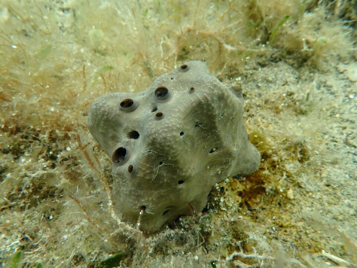
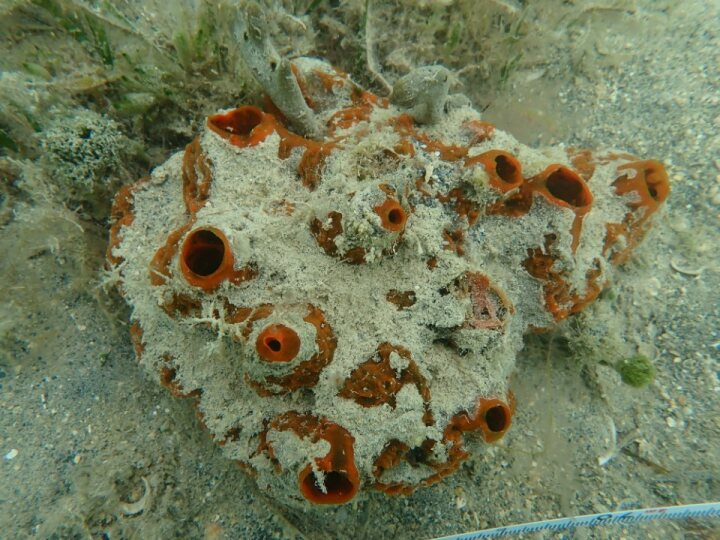
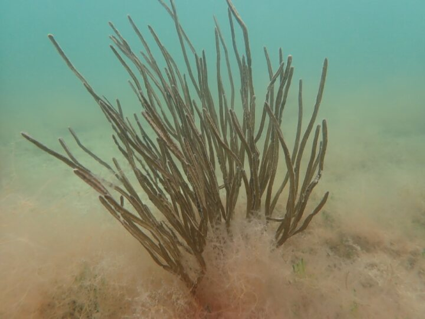

::: {.bnp-header .bnp-text}
# *Biscayne National Park*
:::

::: {.centered-content}
## Assess Impacts of Trawling on Species and Habitats within Biscayne Bay


{.img-right}

#### Overview (Spearheaded by [Mckenzie Zapata](our_lab.qmd#mckenzie-zapata) and [Valentina Bautista](our_lab.qmd#valentina-bautista))
Biscayne National Park (BISC) and the Florida Fish and Wildlife Conservation Commission (FWC) began collaboratively implementing the Biscayne Fishery Management Plan (FMP) in 2020. Included among a variety of regulatory changes that went into effect to support the plan was the creation of a No-Trawl Zone (NTZ) within Biscayne Bay. Upon completion of the FMP, BISC and FWC developed the FMP Science Plan, which is the guiding document to assess the efficacy of the implemented regulations; the FMP Assessment Report is scheduled for completion in 2027. This proposed study will provide critical data for the FMP Assessment Report, by examining changes to benthic habitats with respect to the implementation of the NTZ, trawling fishing effort and landings, and comparing habitat health and fish communities in the Biscayne Bay NTZ and adjacent trawled areas to determine if the NTZ is effectively protecting habitat and wildlife, or if additional regulatory measures (i.e., expansion or modification) are needed. 
:::

::: {.centered-content}

```{=html}
  
  <div style="text-align: center; margin-top: 200px; margin-bottom: 50px">
    <div style="border: 2px solid #55b056; padding-right: 20px;
    padding-bottom: 20px; padding-left: 20px; background-color: #a2dea3; border-radius: 10px; display: inline-block; text-align: center;">
      <h4>Objectives:</h4>
      <p><b>1. Quantify and map the impacts on and the spatial changes in seagrass and hardbottom habitats associated with the NTZ implementation</b></p>
      <p><b>2. Quantify differences of nektonic communities inside and outside of the NTZ boundaries</b></p>
      <p><b>3. Assess the current state of the shrimp fishery</b></p>
    </div>
  </div>
```


#### Methods: 
The Biscayne National Park (BNP) trawl project combines remote sensing, underwater imaging, ecological surveys, and fisheries analyses to evaluate how the 2020 implementation of the No-Trawl Zone (NTZ) has influenced habitats and marine communities throughout Biscayne Bay. Using high-resolution satellite imagery and aerial photography, the project maps changes in seagrass extent, habitat fragmentation, and potential trawl scars over time inside and outside of the NTZ. To assess impacts on hardbottom communities, researchers generate detailed underwater photomosaics using Structure-from-Motion (SfM) photogrammetry to quantify the condition and percent cover of corals, sponges, and gorgonians across randomly selected reef sites. The project also examines nektonic and fish communities through a combination of seine nets, throw traps, fish traps, and underwater visual surveys to compare species diversity, biomass, and community structure among seagrass and hardbottom habitats within and beyond protected areas. In addition, long-term fisheries-dependent datasets are being analyzed to evaluate trends in shrimp fishery landings, effort, and catch-per-unit-effort (CPUE) from 1987–2025. Together, these methods provide a comprehensive assessment of how trawling and fisheries management strategies influence Biscayne Bay’s habitats, biodiversity, and ecosystem health.
:::

```{=html}
<div class="image-container">
    
    
    
</div>
```

::: {.funding-text}
# This Project is funded by the following sponsors: 
:::

```{=html}
<div class="funding">
    
</div>
```


