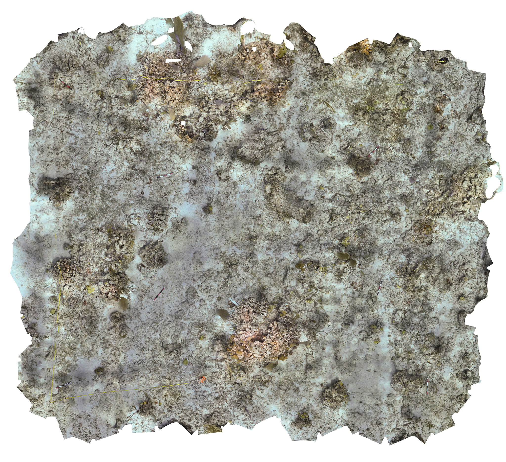

::: {.culebra-header .culebra-text}
# *NE Marine Corridor & Culebra, Puerto Rico*
:::

::: {.centered-content}
## Evaluating Herbivore Impact and Restoration Strategies for Coral Reef Resilience in the Caribbean

*This project consists of two separate grants, together culumating in broadly understanding coral reef resilience and restoration potential in Culebra, Puerto Rico. Please read on to understand both of these projects and their scope.*

{.img-right}

#### Overview (Spearheaded by [Nicolas Rivas](our_lab.qmd#nicolas-rivas))
This project is dedicated to restoring the structural integrity and ecological health of coral reefs in Puerto Rico that have been damaged by hurricanes. By rehabilitating the three-dimensional framework of these reefs, we aim to enhance their resilience, allowing them to better withstand future natural disasters and environmental changes. Coral reefs are vital ecosystems that provide shelter, food, and breeding grounds for countless marine species. Restoring their structure is key to ensuring the long-term biodiversity and functionality of these critical habitats.

#### Goals and Objectives: 
Our primary goal is to rebuild the three-dimensional structure of the reefs to restore their ecological function and support the rich biodiversity they harbor. In doing so, we aim to strengthen their resilience against future hurricanes and the effects of climate change. Additionally, our project seeks to improve the overall health of these reef ecosystems, supporting both marine life and the communities that rely on them.

{.img-left}

#### Methods: 
Our restoration efforts involve a combination of coral propagation, outplanting, and cutting-edge techniques such as 3D printing and photogrammetry to reconstruct and assess the reefs’ structural integrity. These techniques enable us to accurately restore the physical complexity of the reefs, which is essential for promoting healthy coral growth and providing shelter for marine life. We are also implementing a comprehensive monitoring plan to track the progress and effectiveness of our restoration activities. Collaboration with local communities, researchers at the [Sociedad Ambiente Marino](https://www.sampr.org/), and stakeholders is central to our approach, ensuring that the project not only benefits the environment but also aligns with the needs and goals of Puerto Rico’s coastal communities.
This project represents a critical step in the long-term preservation and restoration of Puerto Rico’s coral reefs, ensuring that these ecosystems continue to thrive for future generations.

<div style="clear: both;"></div>


:::

::: {.centered-content}
## RAPID: Here we go again - The fate of *Diadema antillarum* and Caribbean reefs in the 21st century (Spearheaded by [Nicolas Rivas](our_lab.qmd#nicolas-rivas))

This project leverages the existing NFWF grant and gave additional funding to take advantage of the 2021 *D. antillarum* die off in Puerto Rico to monitoring population dynamics of *D. antillarum* and the top down effects this has on macroalgae density within the predefined plots of interest at our study sites.

Coral reef benthic community assemblage and functioning are controlled in part by herbivores that graze on algae, which compete for space with various taxa, including scleractinian coral and sponge species. In the Caribbean, it is hypothesized that the black sea urchin, *Diadema antillarum*, is a keystone grazer that controls macroalgae species composition and biomass at low levels and facilitates the recruitment and survival of reef-building corals, leading to a coral-dominated state of reefs. The recent *D. antillarum* die-off provides the conditions of a natural removal experiment useful to understand the top-down control exertion of this herbivore, especially by quantifying the spatial arrangement progression of benthic functional groups across urchin abundances.
:::

::: {.centered-content}
## Project Publications: 

1\. **Rivas, N.<sup>†</sup>**, *James, W.R.*, **Bautista, V.<sup>†</sup>** et al. Tipping the balance: reef community shifts after a regional urchin population collapse. Coral Reefs (2026). [doi](https://doi.org/10.1007/s00338-026-02822-1) [PDF download](publication_pdfs/Rivas_etal_2026.pdf)

:::

```{=html}
<div class="image-container">
    
    
</div>
```

::: {.centered-content}
## Understanding stony coral community stability over time in the Northeast Marine Corridor

#### Project Overview (spearheaded by [Valentina Bautista](our_lab.qmd#valentina-bautista))

{.img-right}

The [Northeast Marine Corridor (NEMC)](https://maps.coastalscience.noaa.gov/biomapper/biomapper.html?id=prne) encompasses a diverse seascape made up of coral reefs, seagrass beds, nesting beaches, and mangroves forest that support ecosystem functions such as coastal protection, fisheries, and tourism. Local managers with the [Puerto Rico Department of Natural and Environmental Resources](https://www.drna.pr.gov/) have identified eleven Areas of Special Interest (ASIs) for coral reef conservation within the NEMC, yet we lack critical data on community traits and demographic performance that are essential for understanding implications to ecological resilience and function.


#### Goals and Objectives: 
This project aims to enhance coral reef conservation efforts by developing a new ecosystem-based management (EBM) tool for Puerto Rico’s Strategic Management Plan for Coral Reefs in the Northeast Marine Corridor. Current conservation methods rely on simplistic metrics like coral cover, which fail to capture the complex dynamics of reef ecosystems. This project uses a trait-based hypervolume approach to quantify coral community structure and resilience, incorporating ecological traits and demographic data to better predict coral responses to environmental stressors. By improving the accuracy of conservation planning tools, this approach will guide more effective strategies for protecting coral reefs.

#### Methods: 
We will employ advanced digital photogrammetry to create high-resolution (<1 cm) orthorectified photomosaics of coral reefs at key Areas of Special Interest (ASIs) within the Northeast Marine Corridor to quantify Benthic community composition. Environmental conditions, alongside community trait data, will be integrated into the hypervolume analysis to assess coral demographic performance.

<div style="clear: both;"></div>


:::


::: {.funding-text}
# These Projects are funded by the following sponsors: 
:::

```{=html}
<div class="funding">
    
    
    
    
    
    
</div>
```
