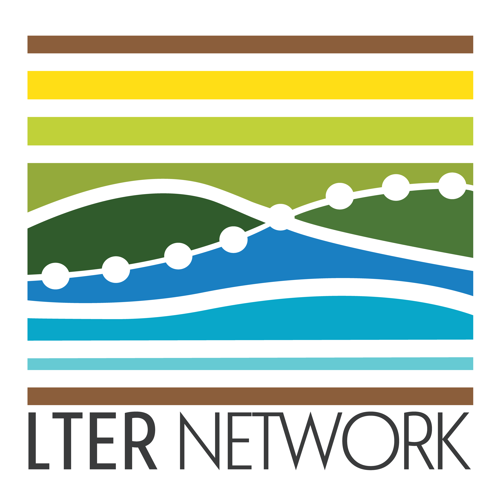
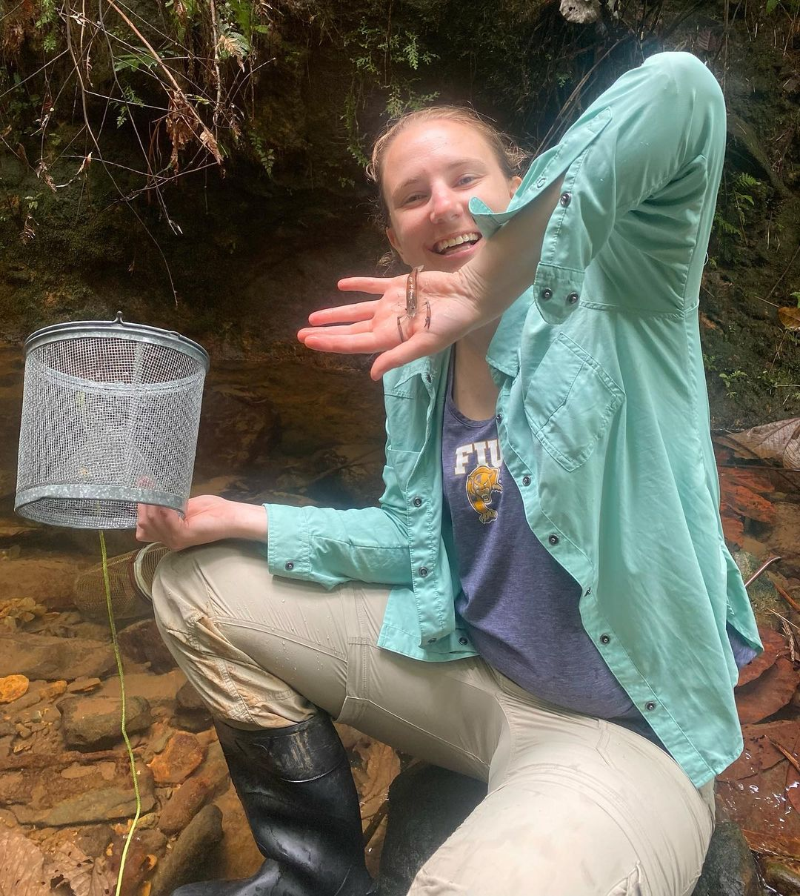
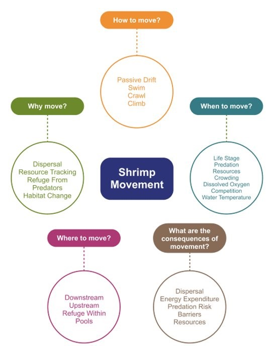
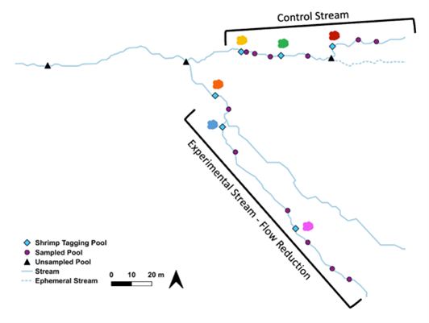
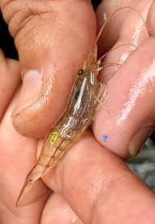

::: {.luq-header .luq-text}
# *El Yunque National Forest, Puerto Rico*
:::

::: {.centered-content}
## Effects of Drought on Freshwater Shrimp Movement in Puerto Rican Headwater Streams

{.img-right}

#### Overview: (Spearheaded by [Lauren Kabat](lab_alumni.qmd#lauren-kabat))
Changing environmental conditions due to climate change and human disturbance impact organism movement via migration, dispersal or foraging in order to adapt to new resource distribution. In the Caribbean, climate change induced droughts are predicted to increase in frequency and severity, and the need for accurate estimates of organism response is needed. Thus, in order to analyze how organisms respond to drought conditions in Caribbean tropical forests, the effect of drought on movement of freshwater shrimp in two adjacent headwater streams was measured using stream discharge, pool size, and shrimp density via a mark recapture methodology.

This experiment took place in the Luquillo Experimental Forest (LEF), part of El Yunque National Forest in northeastern Puerto Rico. This area is also a part of the [Long Term Ecological Research program (LUQ-LTER)](https://luquillo.lter.network/). The LEF is one of the most intensely studied neotropical ecosystems, with ecological research beginning here in the 1940s. At 350 meters above sea level, annual precipitation is about 3500mm. While there is slightly less rainfall from January to April, the LEF is considered an aseasonal rainforest as all months receive approximately 100mm of precipitation. In this study, water in one stream, consisting of many step-pools, was diverted around the pools to model future drought conditions. Freshwater shrimp were chosen as the study organism given their role in the aquatic ecosystem, they dominate the food web in Puerto Rican headwater streams. These shrimps provide ecosystem services such as nutrient cycling, and algae control, and connect coastal and montane ecosystems through their amphidromous lifecycles. The three genera of shrimp present in headwater streams in the LEF are *Macrobrachium*, *Atya*, and *Xiphocaris*.

{.img-center}
:::

::: {.centered-content}
{.img-left}

#### Research Objectives:
**While research has focused on the effects of disturbance on the abundance and density of shrimp, the direct drivers that cue individual shrimp movement between habitat patches remain uncertain.** To fully understand the impacts of drought on shrimp communities in tropical headwater streams, this proposed project will test various tagging technologies and select the most appropriate methodology to track *Atya* and *Xiphocaris* shrimp; and use mark-recapture and environmental data to elucidate the drivers of shrimp movement. By investigating the effects of drought on aquatic animal movement, we will better understand the consequences of climate change that affect both the extreme high and low flows.

#### Methods: 
The Stream Flow Reduction Experiment (StreamFRE) was conducted in two tributaries of the Espiritu Santo River in Puerto Rico, referred to as the Control Stream and the Experimental Stream. In the Experimental Stream, 50% of water flow was diverted over a 150 m stretch during the dry season from February to July in 2022 and 2023. A capture, mark, and recapture (CMR) study was performed in both streams to track shrimp movement, with shrimp in specific pools marked using visible implant tags. These pools, linked by shallow riffles, were chosen for their ability to retain water during droughts. Shrimp traps were baited and set overnight, and recapture surveys were conducted monthly. Over the course of the study, 1,190 shrimp were tagged, allowing researchers to monitor shrimp movements, particularly during the experimental flow reduction period. Data from collaborators also contributed to tracking the shrimp throughout the area.
:::

```{=html}
<div class="image-container">
    
    
</div>
```

::: {.centered-content}
## Project Publications: 

1\. **Kabat, L.<sup>†</sup>**, Crowl, T., Estruche-Santos, Á., Cheshire, J., *Ryan James, W.*, & **Santos, R.** (2026). Comparison of tagging techniques for tracking freshwater tropical shrimp: assessment of survival and behaviour as a function of tag type. Crustaceana, 99(4), 413-437. [doi](https://doi.org/10.1163/15685403-bja10515) [PDF download](publication_pdfs/CR_4506_Kabat.pdf)

:::

::: {.funding-text}
# This Project is funded by the following sponsors: 
:::

```{=html}
<div class="funding">
  
</div>
```
