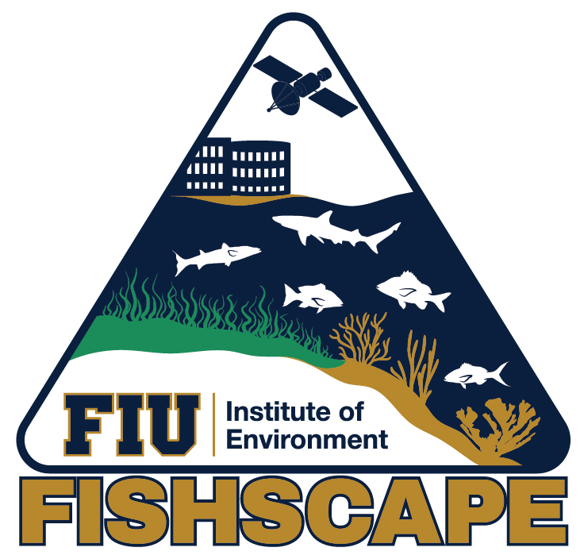
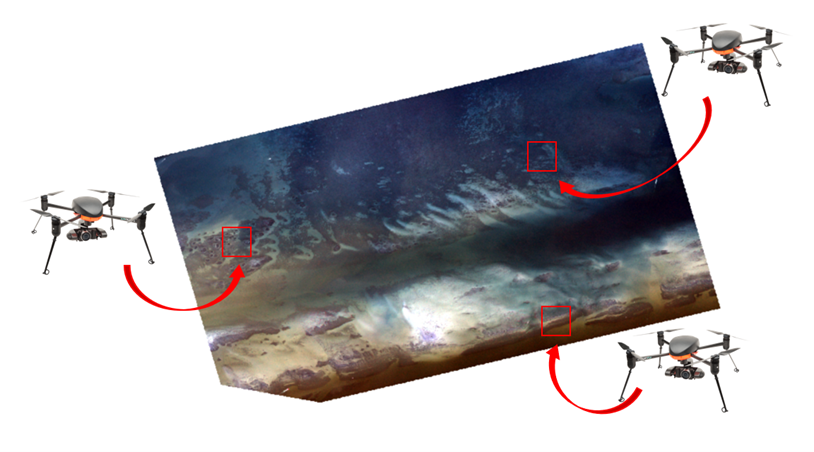
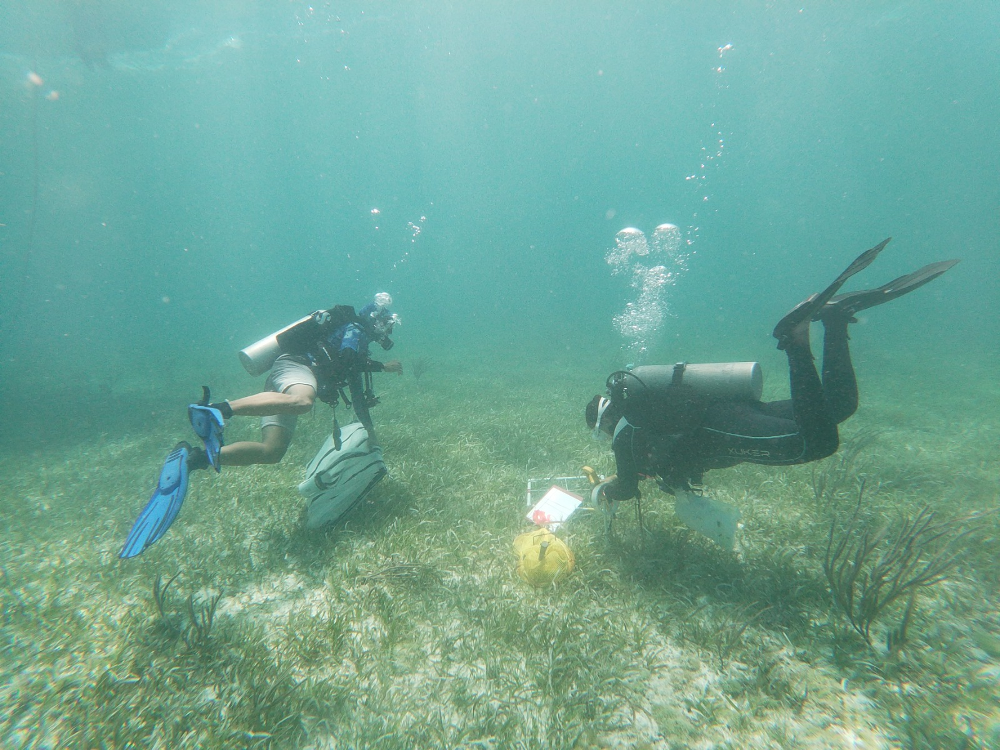
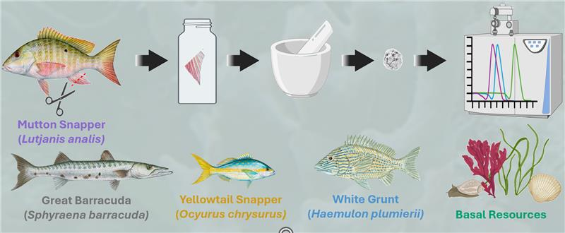
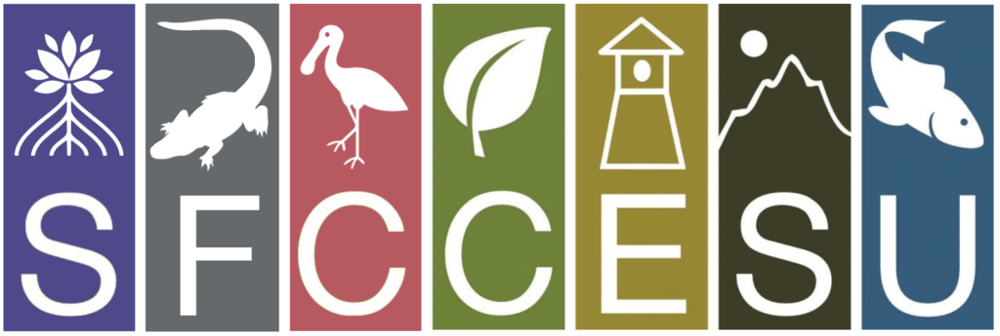
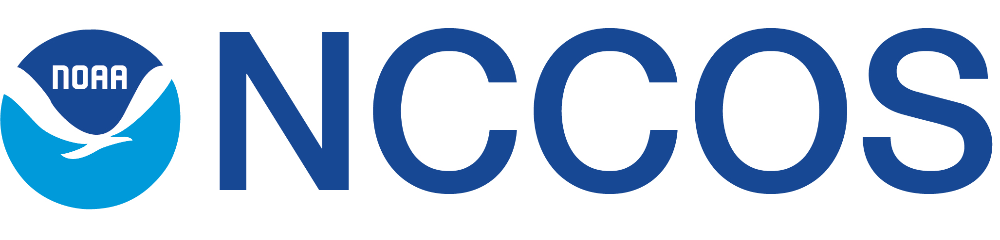

::: {.FISHSCAPE-header .fishscape-text}
# *Florida Keys, FL*
:::

::: centered-content
## Fish In Seagrass Habitats: Seascape Connectivity Across Protected Ecosystems: [FISHSCAPE](https://environment.fiu.edu/what-we-study/projects/fishscape/)

{.img-left}

#### Overview:

Marine protected areas often aim for habitat representation to fulfil the needs of species that forage widely, such as from reefs into seagrass beds. In the Florida Keys National Marine Sanctuary, Sanctuary Preservation Areas (SPAs) contain only a small area of seagrass, but if this was expanded, there is little data on how much seagrass is required to support foraging reef fishes. This project will collect field and laboratory data to provide clear guidance to managers on these seagrass requirements. Project components will include data on seascape characteristics and their potential to change because of environmental stressors, invertebrate and fish prey abundances, risk of predation, fish foraging patterns (using acoustic telemetry), fish physiology, and stable isotopes. These data will be integrated into bioenergetic models that will allow us to estimate the seagrass area needed within a SPA to support foraging reef fishes under current and future habitat states and consequently aid management decisions.

Keep up to date with this project by following the project Instagram! [\@fiu_fishscape](https://www.instagram.com/fiu_fishscape/?locale=English&hl=am-et)
:::

::: {.centered-content}
#### Our Role: Seascape Characterization (Spearheaded by [Marianna Coppola](our_lab.qmd#marianna-coppola))

{.img-right}
Accurate habitat maps underpin the FISHSCAPE project, as seascape configuration drives key ecological processes such as fish foraging patterns and prey abundance. The Seascape Ecology lab has been contributing to the project creating accurate benthic habitat maps through a remote sensing approach. These maps are crucial to delineate seagrass patches and quantify seascape characteristics across the Florida Keys National Marine Sanctuary. To address ecological problems at multiple spatiotemporal scales, we aim to integrate in situ data with multispectral images acquired by unmanned aerial vehicles (i.e. drones) and medium- to coarse-resolution satellites. This proposed multi-scale mapping approach will enable us to quantify the relationships between organisms and their habitats by assessing functional connectivity. It will do so by identifying seagrass habitat characteristics surrounding reefs across various seascape scales commonly used by foraging fishes within the FKNMS.

{.img-center}
:::

::: {.centered-content}
#### Our Role: Ecosystem Function (Spearheaded by [Gina Badlowski](our_lab.qmd#gina-badlowski))

{.img-left}

Ecosystem functions can vary depending on habitat structure (e.g., species composition, canopy height, size, and location). Recent studies have shown that even when habitat structures appear similar, they do not always result in similar ecosystem functions, such as supporting food webs. While monitoring and management actions often focus on the structural aspects of habitats, we propose adopting management strategies incorporating a more comprehensive understanding of ecosystem functions. To accomplish this, we suggest using E-scape maps [spatially explicit production maps, identifying areas where food resources are abundant or scarce by calculating a Habitat Resource Index (HRI)], which correlate seagrass habitat structure with food web dynamics and energy flow. These E-scapes integrate seagrass seascape characterization (see above), prey availability (led by the Campbell Lab), and food web models derived from stable isotope analysis. We collect basal resources (e.g., seagrass, macroalgae), lower trophic level prey species (e.g., gastropods, small fishes), and fin clip samples from acoustically tagged focal fish. These samples are analyzed for carbon, nitrogen, and sulfur stable isotopes to determine the contribution of seagrass meadow and reef-derived food sources to different trophic levels.

{.img-center}
:::

::: {.funding-text}
# This Project is funded by the following sponsors: 
:::

```{=html}
<div class="funding">
    
    
</div>
```
