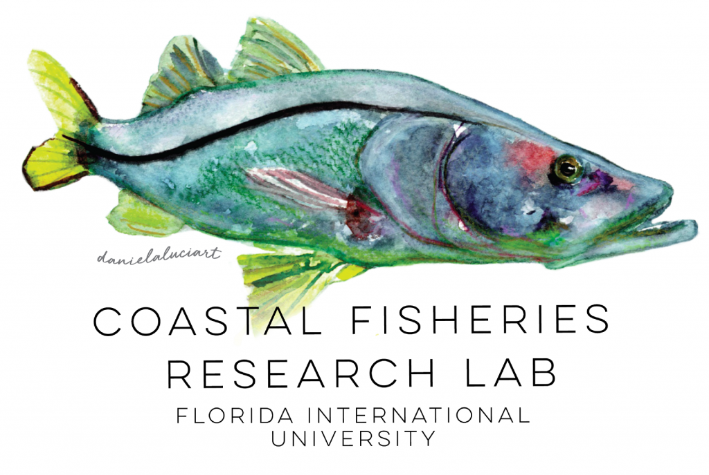

:::{.fisheries-header}

:::

:::{.centered-content}
## Coastal Fish Ecology and Fisheries Lab

Other Projects in our lab pair closely with [Dr. Jennifer Rehage](jenn_rehage.qmd)'s Lab, located within the FIU institute of Environment Earth and Environment department. Since our work with seascape ecology aligns closely with movement ecology, we collaborate heavily together and have deemed each other "sister labs.

The Rehage Lab consists of coastal ecologists, passionate about fish and fisheries and the issues that affect them, particularly water and climate issues and their interacting effects. We focus on understanding how water and water management decisions interact with climate patterns to affect fish and the quality of recreational fisheries. Our research takes a holistic approach to studying fish, integrating from the behavior of individuals to populations and entire fish communities and their effects and responses to ecosystem processes, their interactions and responses to both natural and human disturbances, and extending to the human dimensions of fish- involving anglers in science and understanding their knowledge and perceptions. Ongoing research efforts aim to understand how fishes move through their seascapes, what drives these movement, how those movements fit into large-scale ecosystem processes and what are the consequences for socio-economically valuable recreational fisheries. Our research mainly takes places in the Everglades and coastal South Florida, and we focus on key recreational species such as: Tarpon, Snook, Bonefish, Florida Bass, Jack Crevalle, and Redfish. **If this research is of interest, you can click on the lab logo below to be directed to Dr. Rehage's Lab page!**
:::

::: {.centered-logo}

:::

