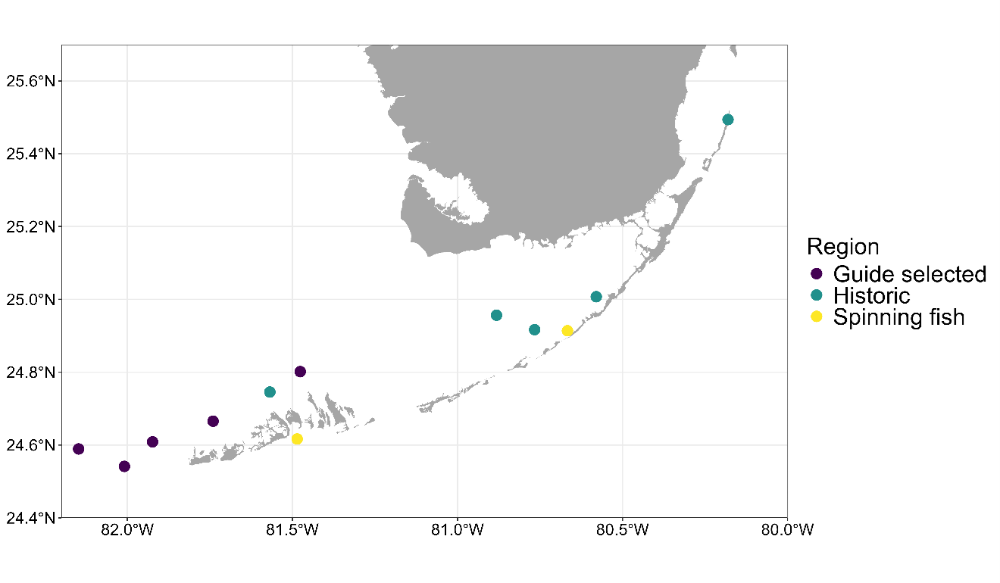
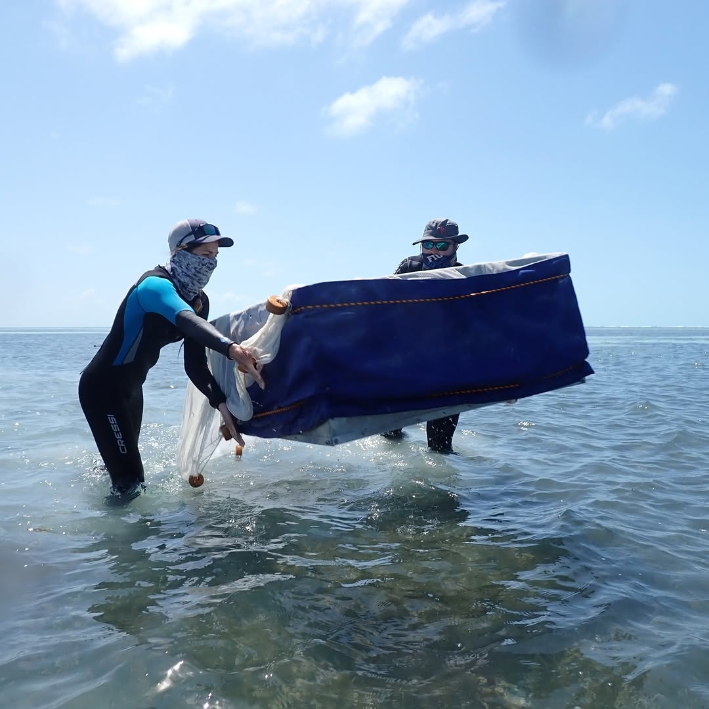
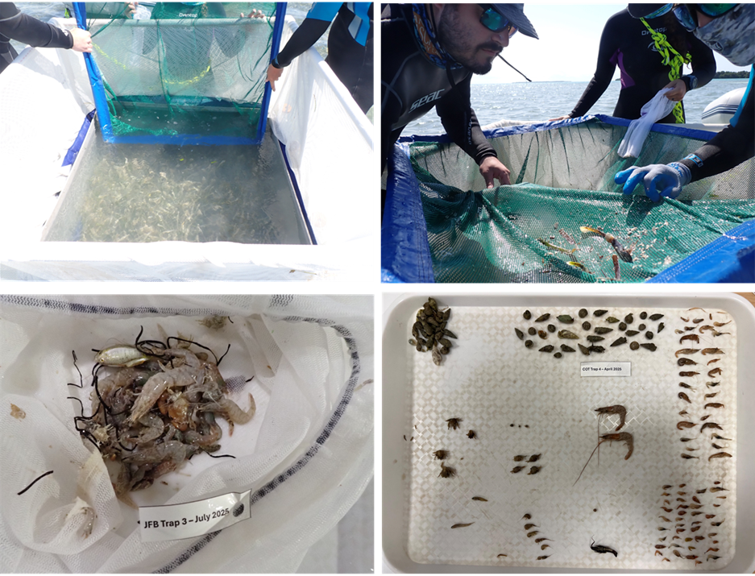
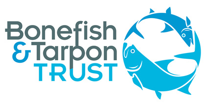

::: {.btt-header .btt-text}
# *Florida Bay, FL*
:::

::: {.centered-content}
## Holistic assessment of the Florida Keys flats food webs

{.img-left}

#### Overview:

The Florida Keys flats provide essential habitat for a variety of recreationally important fish species, including bonefish and permit, yet recent observations indicate declines in fishing quality and shifts in fish behavior. This project aims to understand how seagrass and shallow flats support prey communities and how those prey influence the diet and resource use of key flats species. Over three years, we will assess spatial and temporal variation in prey abundance, biomass, and diversity across Biscayne Bay and the Florida Keys. We will collect fin clips and DNA swabs from bonefish and permit to determine their diet using stable isotope and DNA metabarcoding analyses. Prey communities will be sampled using standardized throw traps along seagrass flats to quantify abundance, biomass, and diversity. Habitat characteristics, including seagrass cover, fragmentation, and seascape configuration, will be mapped and analyzed to understand drivers of prey distribution. Historical data will be used to evaluate long-term shifts in prey communities. Collaboration with fishing guides will ensure regionally representative sampling and facilitate outreach. This integrated approach links habitat, prey availability, and fish diet to support effective fisheries management. Findings will inform conservation strategies that sustain both recreational fisheries and the ecological health of the flats.

:::

::: {.centered-content}
#### Goals and Objectives: (Spearheaded by [Dr. Ryan James](our_lab.qmd#dr-w-ryan-james")

{.img-right}
The overarching goal is to investigate the connections between seagrass flats, prey production, and the feeding ecology of recreational flats fish. Specific objectives are: 1) determine spatial variation in diet and resource use of bonefish and permit, 2) quantify spatiotemporal patterns in prey abundance, biomass, and diversity, and 3) assess how habitat composition and seascape configuration influence prey communities. This knowledge will help identify areas of high ecological value and inform fisheries management decisions. Outcomes will support the sustainability of recreational fisheries and enhance conservation planning. The project also aims to integrate historical data to detect long-term trends in flats food webs.
:::

::: {.centered-content}
#### Methods: 
We will collect fin clips and DNA swabs from 100 individuals each of bonefish and permit per year across five regions for stable isotope and DNA metabarcoding analyses. Prey communities will be sampled at 12 sites using throw traps along seagrass transects during multiple seasons to capture temporal variation. Primary producers and abundant prey species will be collected for stable isotope analysis to assess resource use. Habitat composition and configuration will be mapped using high-resolution satellite imagery and ground truthing, and seascape metrics will be calculated to relate habitat features to prey communities. Data will be analyzed using univariate and multivariate approaches to determine how spatial and temporal patterns in prey and habitat influence flats fish diet and resource use.

{.img-center}

:::

::: {.funding-text}
# This Project is funded by the following sponsors: 
:::

```{=html}
<div class="funding">
    
</div>
```
