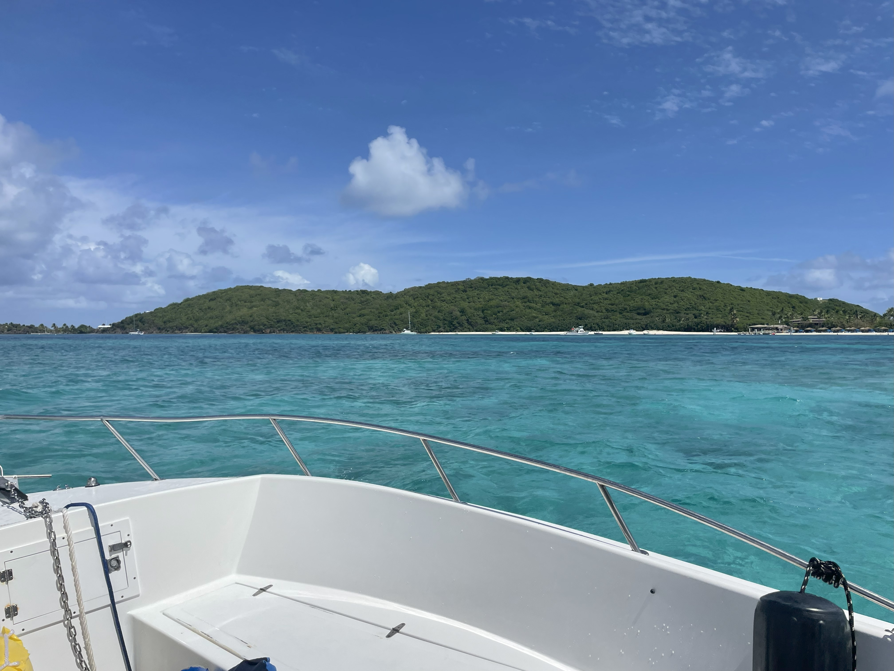

```{=html}


<div class="research-landing">

<h1>Completed Research Projects:</h1>
  
<div class="trip-container">
  <!-- Trip 3 -->
  <div class="trip-card">
    <div class="overlay"></div>
    <a href="Culebra.qmd">
      
      <h2>Puerto Rico Seascapes</h2>
    </a>
  </div>


  <!-- Add more trip cards here -->
</div>

</div>

```