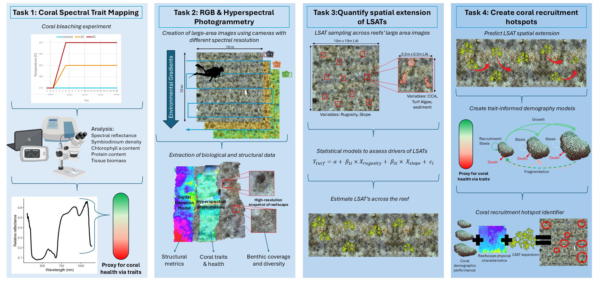
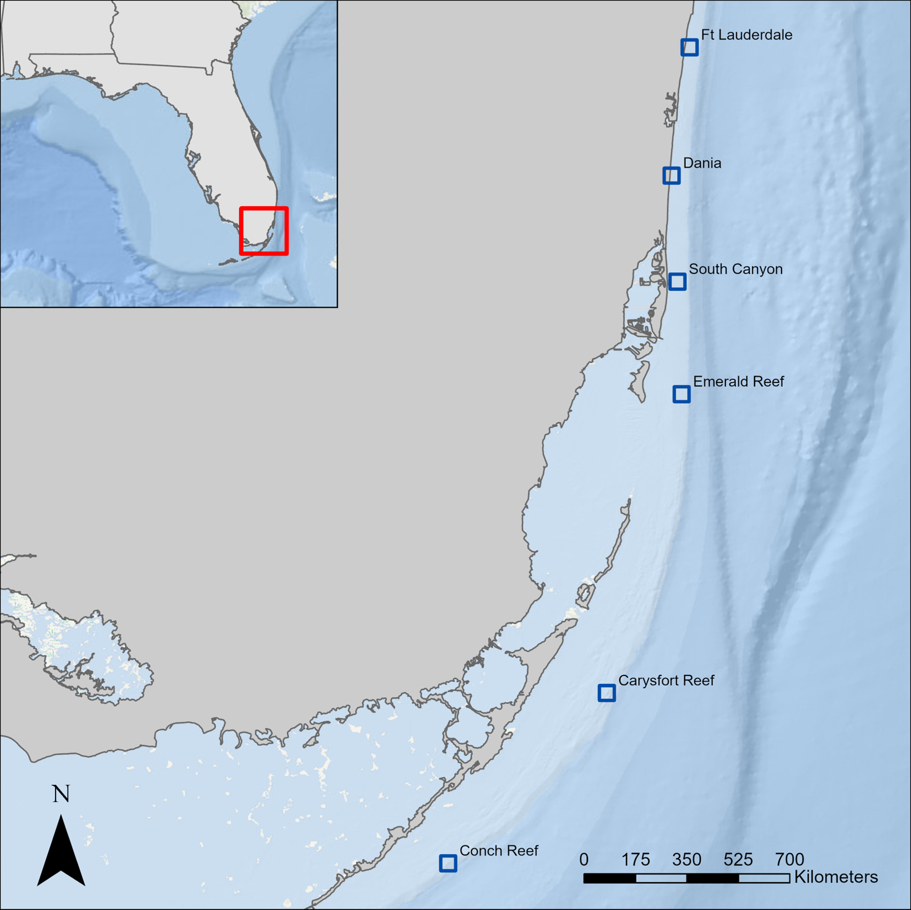
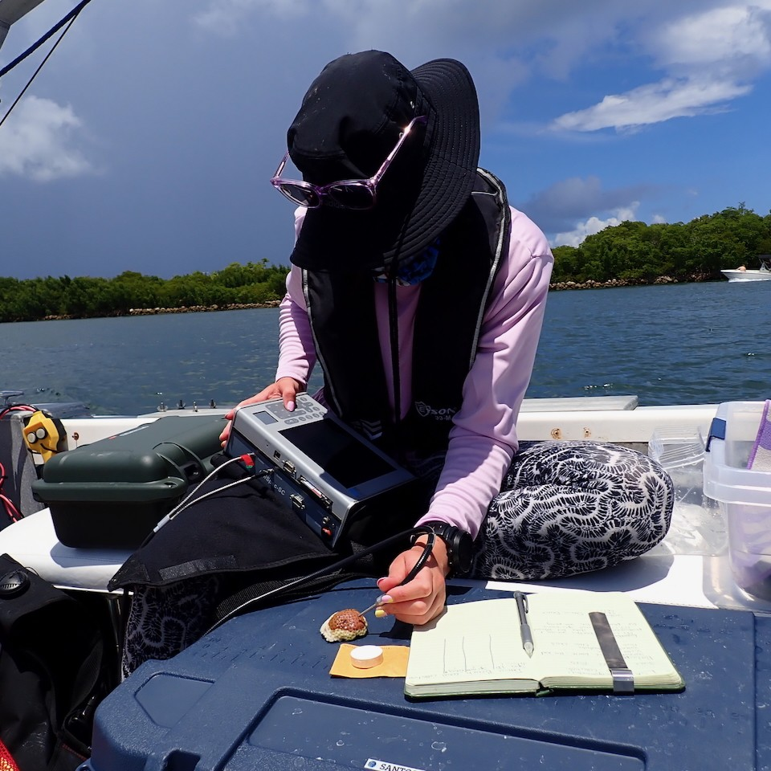

::: {.cs-header .cs-text}
# *South Florida Reef Tract*
:::

::: {.centered-content}
## Monitoring coral reefs through a digital eye: Creating and implementing a hyperspectral imaging photomosaic approach to assess sediment-turf conditions and coral health

{.cs-diagram}
*This project consists of two separate grants, together culumating in broadly understanding how biochemical traits of corals interact to alter reflectance and subsequently how we can use this information to monitor coral interactions with Long Sediment Laden Algal Turfs.*

#### Project Overview (Spearheaded by [Hannah-Marie Lamle](our_lab.qmd#hannah-marie-lamle))

For decades, coral reef monitoring has relied on methods like transects and photo quadrats, which provide only limited snapshots of reef health. These approaches are often slow, cover only small areas, and make it hard to detect subtle changes in coral populations or threats to reef ecosystems. Advances in imaging and computing now allow scientists to capture large-scale, high-resolution data that can reveal more about reef structure and the health of corals. Our project uses hyperspectral imaging and photomosaics (digital maps stitched from hundreds of underwater photos) to observe reefs in unprecedented detail. This method can detect small differences in coral color and reflectance that relate to their health, something traditional monitoring often misses. We are particularly focused on mapping long sediment-laden algal turfs (LSAT), which can harm young corals and hinder reef recovery. By combining 3D models, large-area images, and spectral data, we can identify where LSATs are most prevalent and how they affect coral growth and survival. The data will also allow us to estimate coral “fitness,” or the likelihood of corals to grow, survive, and reproduce, across entire reef landscapes. Ultimately, this digital approach provides a more efficient, accurate, and scalable way to monitor reefs and support restoration efforts. By integrating these tools, managers and conservationists can make better-informed decisions to protect and restore South Florida’s coral reefs.
:::

::: {.centered-content}
#### Goals and Objectives:

{.img-right}

The main goal of this project is to improve how coral reefs are monitored and managed by combining high-resolution images, 3D models, and hyperspectral data. We aim to create a tool that can show where sediment-laden algal turf (LSAT) is most abundant and how it affects coral health. Another key objective is to estimate coral “fitness,” meaning how likely corals are to grow, survive, and reproduce under different conditions. We also want to develop methods that can be used over large areas and repeated over time, so managers can track reef health and plan restoration efforts more effectively.

#### Methods: 

We will work at six priority reef sites in South Florida, selecting four plots at each reef to focus our studies. Using underwater cameras and hyperspectral imaging, we will capture hundreds of overlapping photos to create detailed 2D maps and 3D models of each plot. These images will allow us to identify coral species, measure coral health, and detect areas dominated by LSAT. We will also link coral color and reflectance to physiological traits, like pigment levels and symbiont density, to create coral fitness indices. Machine learning and other modeling tools will be used to predict where LSATs occur and how they influence coral recruitment and growth across the reefscape. Together, these methods provide a non-invasive, high-resolution way to monitor reef conditions and guide restoration planning.
:::

```{=html}
<div class="image-container">
    
    
</div>
```

::: {.funding-text}
# This Project is funded by the following sponsors: 
:::

```{=html}
<div class="funding">
    
    
</div>
```

