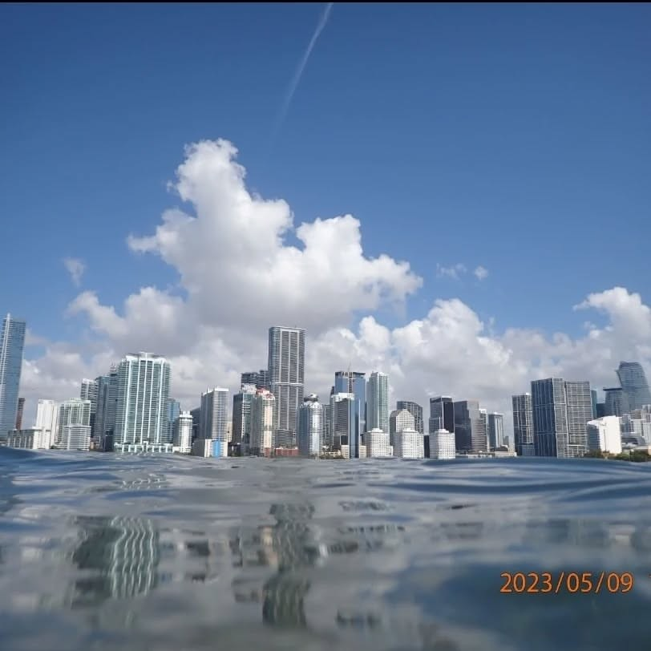
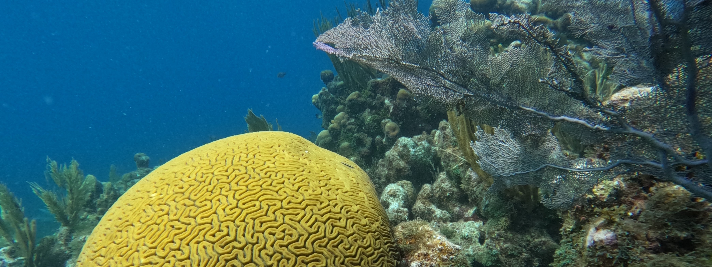
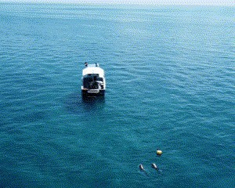
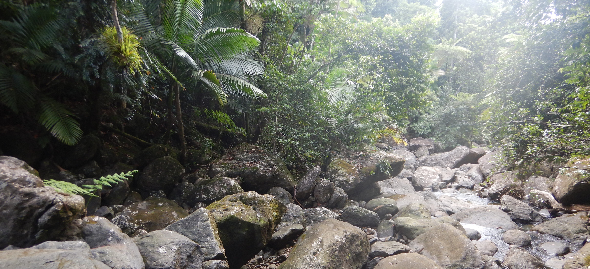

```{=html}


<div class="research-landing">

<h1> Ongoing Research Projects:</h1>

<div class="trip-container">
  <div class="trip-card">
    <div class="overlay"></div>
    <a href="biscayne_bay.qmd">
      
      <h2>Biscayne Bay Seagrass Stability</h2>
    </a>
  </div>

  
  <div class="trip-card">
    <div class="overlay"></div>
    <a href="coral_spectral.qmd">
      
      <h2>Coral Spectral Traits</h2>
    </a>
  </div>
  
    
  <div class="trip-card">
    <div class="overlay"></div>
    <a href="FISHSCAPE.qmd">
      
      <h2>FISHSCAPE</h2>
    </a>
  </div>
  
  
  <div class="trip-card">
    <div class="overlay"></div>
    <a href="El_yunque.qmd">
      
      <h2>El Yunque Shrimp Movement</h2>
    </a>
  </div>

  <div class="trip-card">
    <div class="overlay"></div>
    <a href="btt_foodwebs.qmd">
      
      <h2>Florida Keys Flats Food Webs</h2>
    </a>
  </div>

  <!-- Add more trip cards here -->
</div>

</div>

```