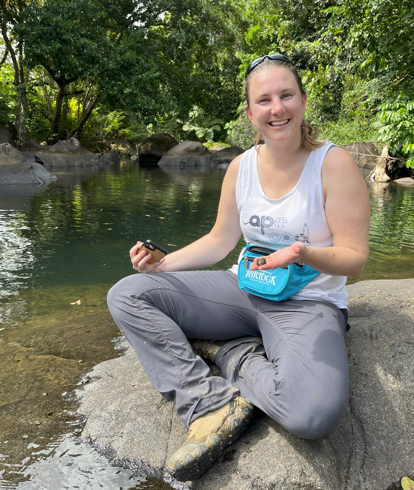
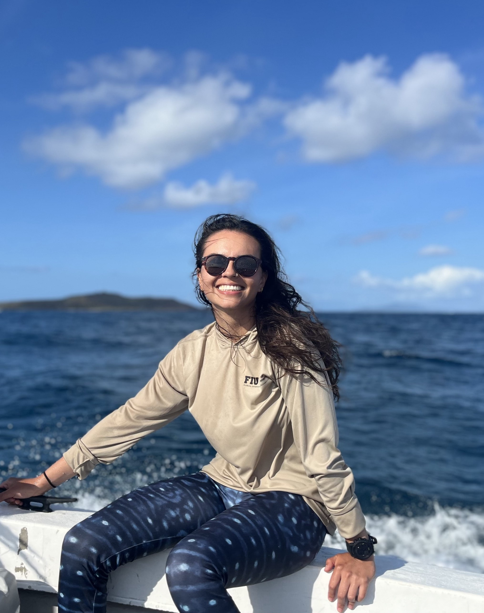
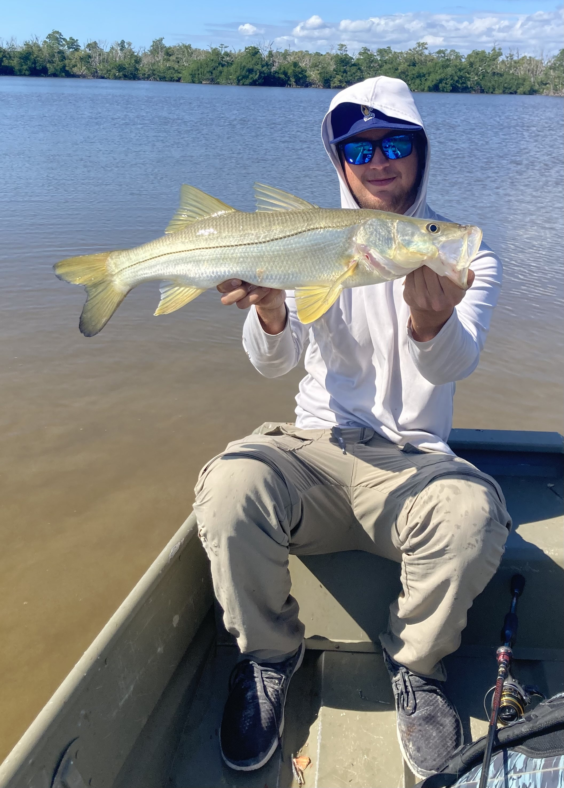
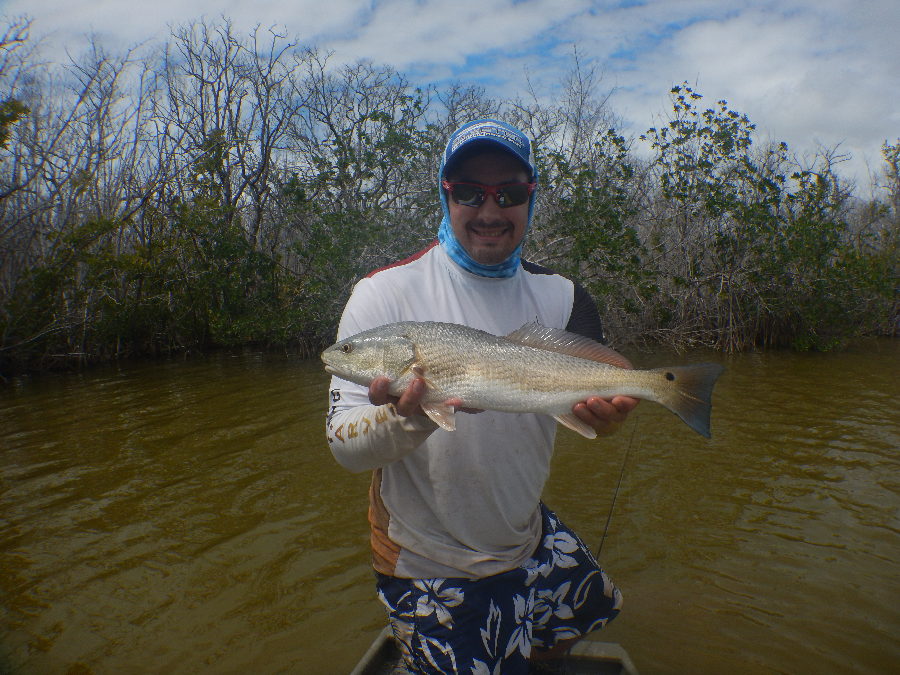
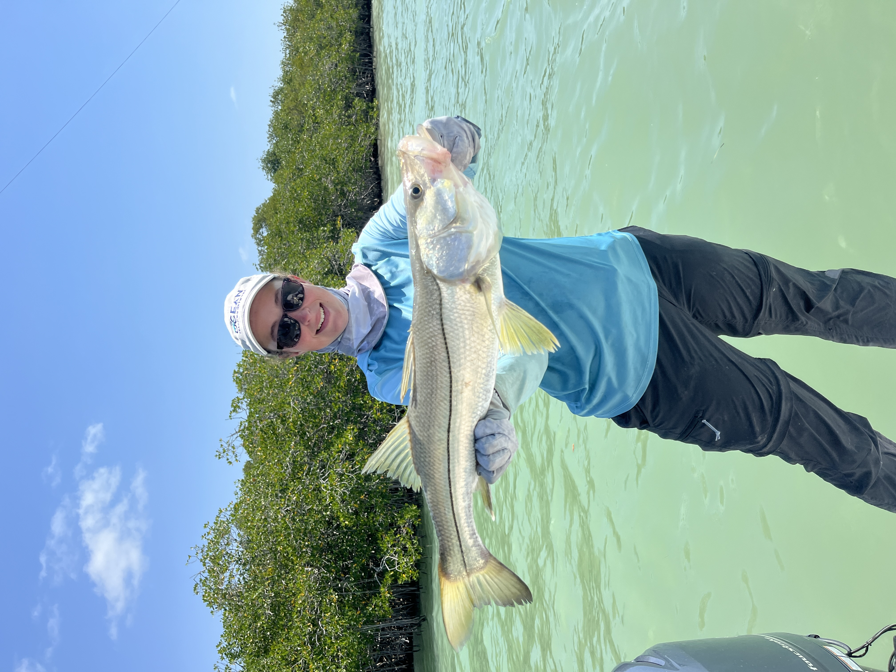
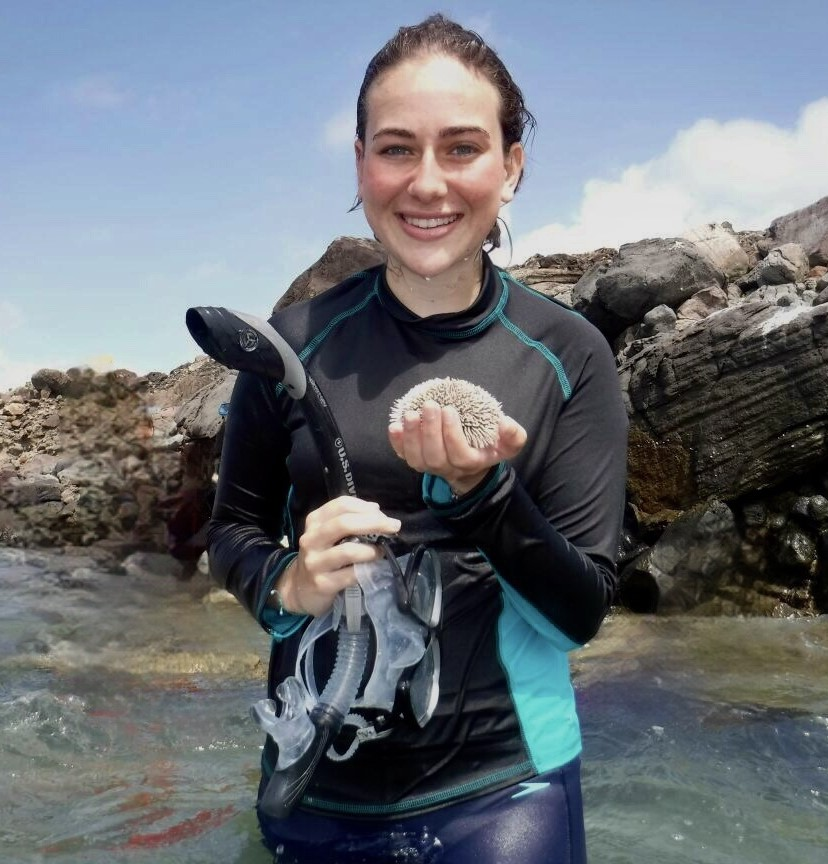

```{=html}
<div class="centered-content">
  <div class="member-container">
      <!-- First member -->
      <div class="main-column">
          <div class="member-info">
              <h2>Lauren Kabat</h2>
              <h4><em>M.S. 2021 - 2023</em></h4>
              <p>Lauren was the first graduate of the SEL lab, where she studied shrimp movement in response to water diversion in mountain step-pools in El Yunque National Forest, Puerto Rico. This research is significant as it can provide insights into how the tropical forest ecosystems of Puerto Rico will respond to altered climate conditions due to warming. Since graduating, she took some time off to restore a sailboat and venture "wherever the wind took her" before landing a summer seasonal job in Alaska as an ecological tour guide. Now, she has made the move to the big island of Hawai'i, where she will be seeking employment in a marine science related job position. </p>
          </div>
      </div>
      <div class="side-column">
          
      </div>
  </div>
  
  <div class="member-container reversed">
      <!-- Second member -->
      <div class="main-column">
          <div class="member-info">
              <h2>Valentina Bautista</h2>
              <h4><em>M.S. 2022 - 2024</em></h4>
              <p>Valentina Bautista is a recent gradute of the SEL lab, her focus was in quantifying the trait space of geographic regions of Puerto Rico both across time (each region separately analyzed to understand shifting trait space of coral communities) and across space for the most recent sampling years (2016-2023). Additionally, she collected photomosaic data that was not utilized for her thesis work, so she will be staying on with the lab as a research associate, where she will continue to process photomosaics and analyze the benthic community from these plots over all time points.</p>
          </div>
      </div>
      <div class="side-column">
          
      </div>
  </div>
  
  <div class="member-container">
      <!-- third member -->
      <div class="main-column">
          <div class="member-info">
            <h2>Brenden Ramiz</h2>
              <h4><em>Research Technician 2023 - 2025</em></h4>
              <p>Brenden is an ecologist from Ft. Lauderdale Florida, with a bachelor’s degree in environmental sciences from Florida International University. He volunteered in the Santos lab during his undergraduate and completed an independent study about the population trends of the invasive fish species found in Northern Florida Bay with Dr. Santos.  After graduation he continued to work as a Lab Tech in the Santos Lab. Brenden committed to assisting in fieldwork within Biscayne Bay and working on the stable isotopes processing field samples collected from the multiple ongoing projects. He is now a field ecologist for the South Florida Water Management District.</p>
          </div>
      </div>
      <div class="side-column">
            
      </div>
  </div>
  
  <div class="member-container reversed">
      <!-- Fourth member -->
      <div class="main-column">
          <div class="member-info">
              <h2>Dr. Jonathan Rodemann</h2>
              <h4><em>Postdoctoral Scholar 2024 - 2025</em></h4>
              <p>Jon is a seascape and movement ecologist focusing on the impacts of disturbances on multi-scale processes such as recovery and habitat selection. He obtained his B.S. in Marine Science and Biology from the University of Miami, and subsequently attended a non-thesis based Master’s program at Northeastern University called the Three Seas Program, spending time in Boston, Panama, and Washington state learning about the marine ecosystems of the regions. This program ended with an internship with the Smithsonian’s Tennenbaum Marine Observatories Network looking at the variation in marine consumption pressure along a latitudinal gradient. He then transitioned back down to south Florida, to complete his Ph.D. at FIU in the <a href="https://myweb.fiu.edu/rehagej/">Coastal Fisheries Lab.</a> He concluded a postdoctoral position in the Santos SeaScape Ecology and Rehage Coastal Fisheries lab, using multiple approaches such as remote sensing, acoustic telemetry, and causal modelling to understand the impacts of press (lack of freshwater inflow) and pulse (seagrass die-off and hurricanes) disturbances on the Florida Bay ecosystem. Jon is a current postdoctoral scholar at the National Center for Ecological Analysis and Synthesis (NCEAS) working on the <a href="https://www.nceas.ucsb.edu/gulfeco">Gulf Ecosystem Initiative Project</a>.</p>
          </div>
      </div>
      <div class="side-column">
          
      </div>
  </div>
  
  <div class="member-container">
      <!-- Eigth member -->
      <div class="main-column">
          <div class="member-info">
              <h2>Victoria Goldner</h2>
              <h4><em>Lab Manager and Field Lead 2023 - 2025</em></h4>
              <p>Victoria is a Florida native who received her bachelor’s degree in marine biology from New College of Florida, where she developed a passion for acoustic telemetry through her undergraduate honors thesis research on blacktip shark migration patterns over time and their relationship with climate change. In addition to being a PADI certified divemaster, she has a background in animal husbandry and science communications & outreach. Over time, she has worked in the Everglades, Biscayne National Park, the Florida Keys, Florida Bay, the Tampa Bay area, and Culebra, Puerto Rico, and her favorite animal she’s had the opportunity to work with is a smalltooth sawfish <i>(Pristis pectinata)</i>. In addition to supporting the labs in all their day-to-day operations, she was involved in nearly every project our labs have to offer. Victoria has since transitioned to the <a href="https://www.peclabfiu.com/">Predator Ecology Lab</a> at FIU under the guidance of Dr. Diego Cardenosa for her Masters.</p>
              <p>email: <a href="mailto:vgoldner@fiu.edu">vgoldner@fiu.edu</a></p>
          </div>
      </div>
      <div class="side-column">
          
      </div>
  </div>
  
  
    <div class="member-container reversed">
      <!-- Tenth member -->
      <div class="main-column">
          <div class="member-info">
              <h2>Christine Nation</h2>
              <h4><em>Lab Manager and Laboratory Operations Lead 2023 - 2026</em></h4>
              <p>Christine is a biologist from Venezuela, with an M.P.S. in Fisheries Management and Conservation, who served as the Santos Lab Manager and Laboratory Operations Lead. Before moving to Miami to pursue her M.P.S. at the University of Miami, she lived in Colombia. During her studies, she completed her M.P.S. internship report with the Santos Lab and continued working there after graduating. Christine was dedicated to supporting the team and assisting students with their research projects. She has been involved in conservation efforts in Culebra, Puerto Rico, where she analyzed BRUVs data to study reef fish abundance and participated in fieldwork for BRUV setup and deployment. She used the BRUVs data to study the abundance of target snapper and grouper species across different habitat complexities. Christine also assisted with calibrating coral reef photomosaics using Viscore and outlining the reef’s macroalgal cover. In the lab, she helped process stable isotopes from various samples, including seagrass, algae, invertebrates, and fish, for food web ecology. Christine is returning to live in Colombia with her fiance and pursue a career in science communication.</p>
          </div>
      </div>
      <div class="side-column">
          
      </div>
  </div>
  
</div>  
```
