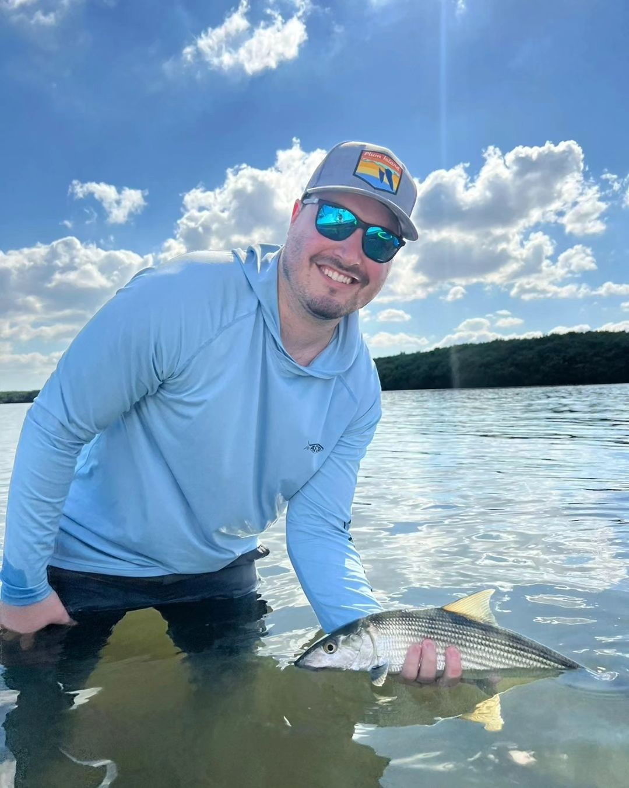
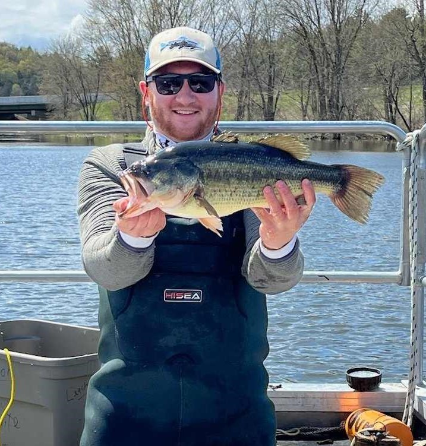
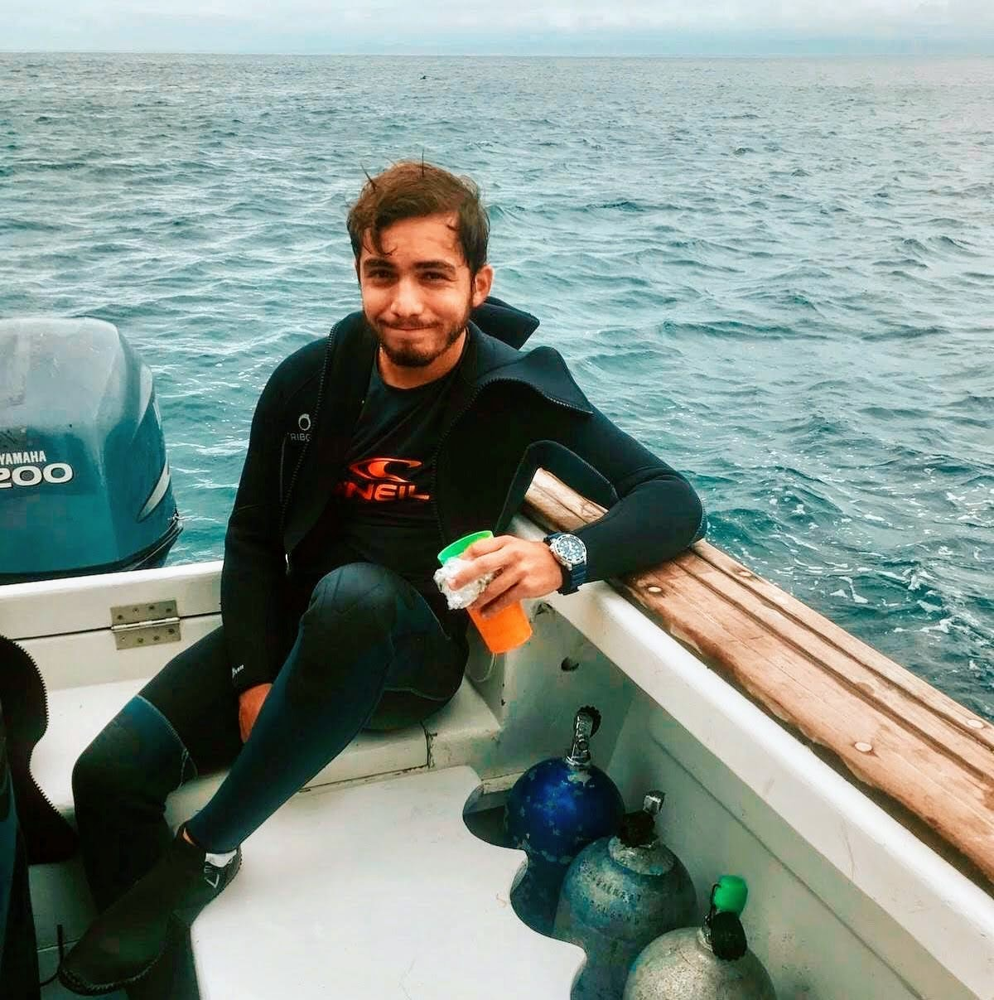
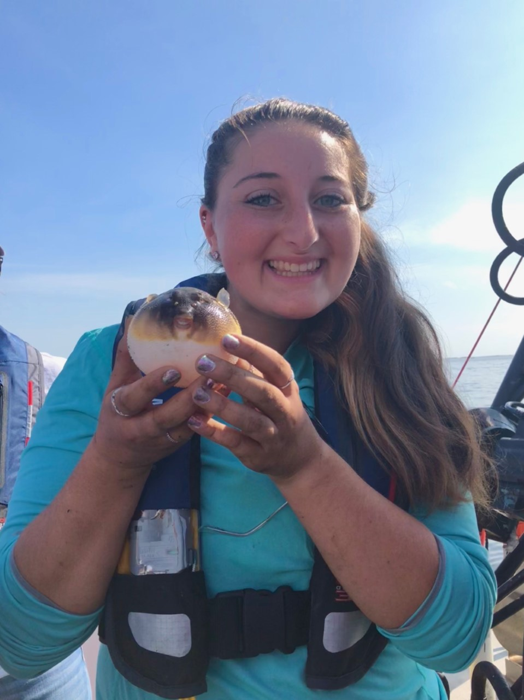
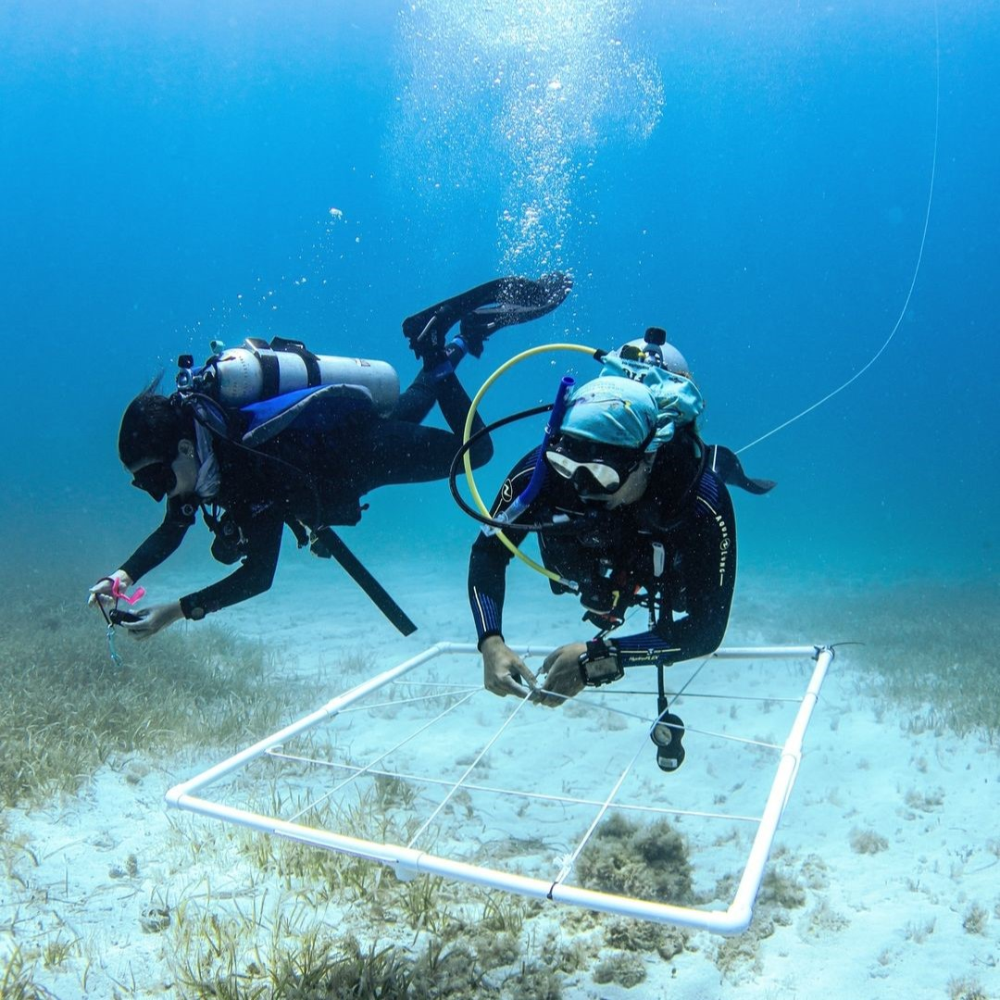
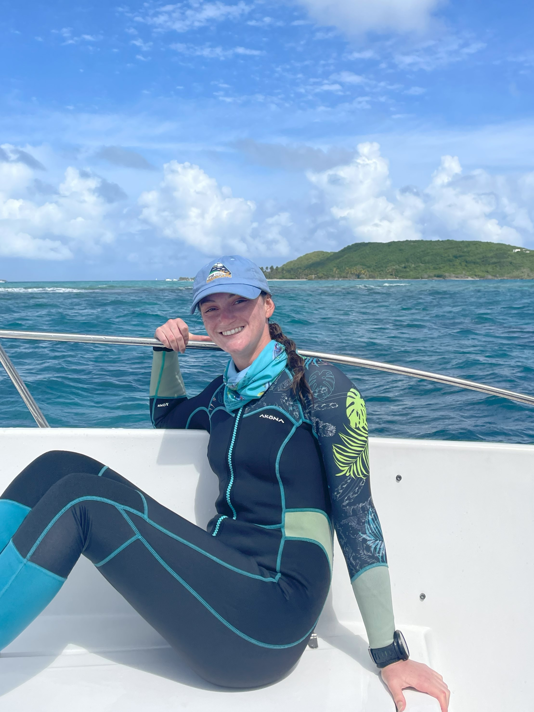
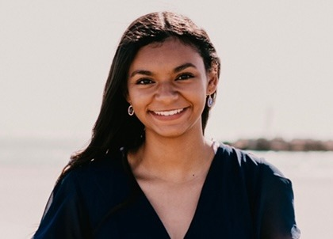
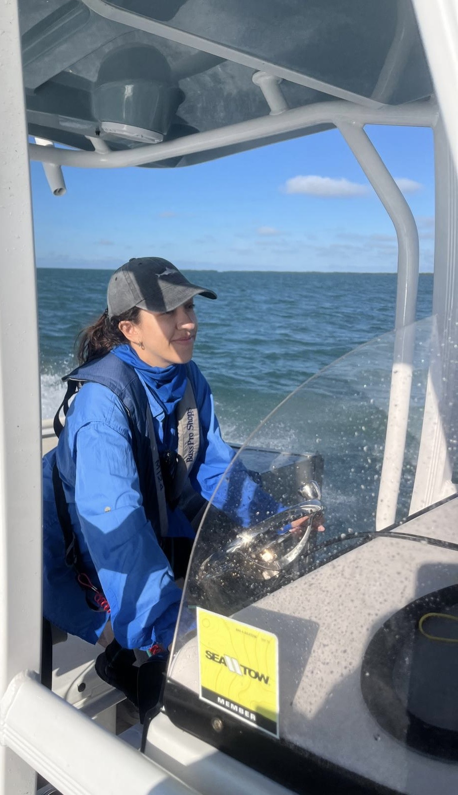
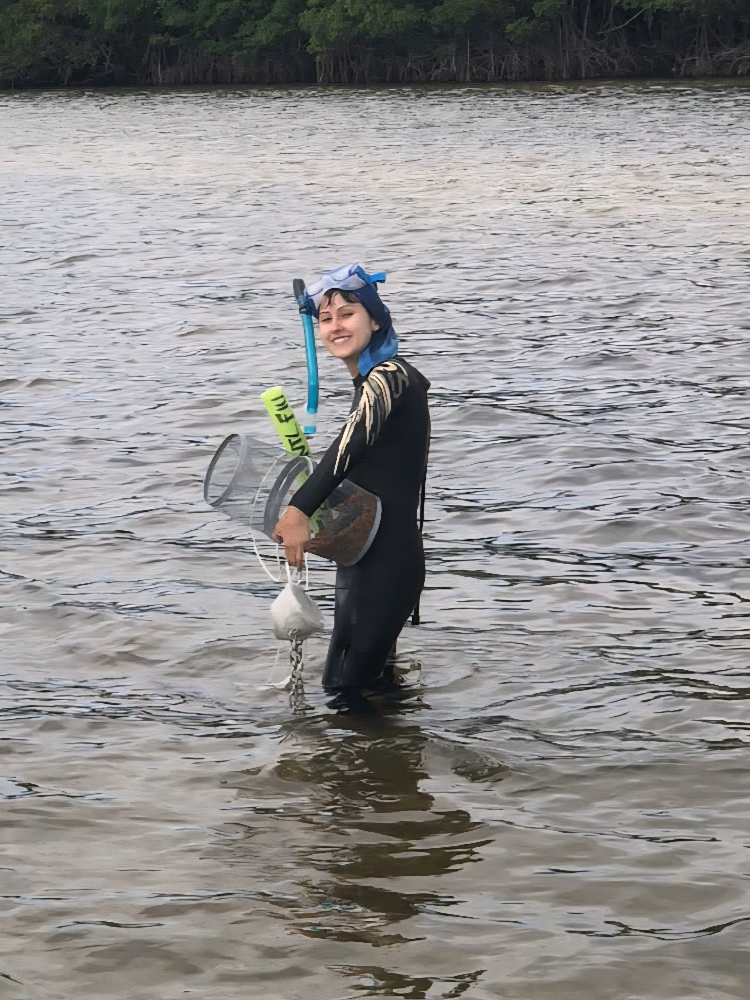

```{=html}
<div class="centered-content">
  <div class="member-container reversed">
      <div class="main-column">
          <div class="member-info">
              <h2>Dr. W. Ryan James</h2>
              <h4><em>Research Assistant Professor</em></h4>
              <p>Ryan is an interdisciplinary scientist interested in understanding the drivers of ecosystems at multiple scales. He has developed expert knowledge of Gulf coast estuarine ecosystems, receiving his B.S. in Biology at the University of Alabama and M.S. at the University of Alabama Birmingham. He went on to complete his Ph.D. at the University of Louisiana at Lafayette, titled "A Seascape Approach to Understanding Coastal Food Web Dynamics and Species Distributions" under advisor <a href="https://biology.louisiana.edu/James-Nelson">Dr. James Nelson</a>, who is also a collaborator with the lab. His research takes an integrative approach asking questions across multiple scales to understand the response of biodiversity, fisheries, and ecosystem function to spatial variability in biotic and abiotic factors and future change to inform effective conservation strategies.</p>
              <p>email: <a href="mailto:wjames@fiu.edu">wjames@fiu.edu</a></p>
              <p><a href="https://wryanjames.github.io/">Website Link</a></p>
          </div>
      </div>
      <div class="side-column">
          
      </div>
  </div>


<div class="member-container">
      <div class="main-column">
          <div class="member-info">
              <h2>Dr. Justin Lesser</h2>
              <h4><em>Postdoctoral Scholar</em></h4>
              <p>Justin is a food web ecologist interested in cross-habitat, consumer-mediated flows of energy that couple ecosystems across space and time, as well as the general principles and rules that structure food webs across systems. He received a B.S. in Neuroscience and a B.A. in Biology from Brandeis University, and an M.S. in Marine Biology from Northeastern University, through the Three Seas Program. Justin then completed his Ph.D. at the University of Louisiana at Lafayette with <a href="https://biology.louisiana.edu/James-Nelson">Dr. James Nelson</a>, where he was a member of the <a href ="https://pie-lter.mbl.edu/">Plum Island Ecosystems LTER</a>. Immediately prior to joining the lab, Justin was a Postdoctoral Researcher at the <a href="https://www.uvm.edu/rsenr/rubensteinlab">Rubenstein Ecosystem Science Laboratory</a> at the University of Vermont, as well as the VT-USGS Fish and Wildlife Research Co-op Unit, where he worked on whole-lake food web models, the impacts of invasive and understudied species on lake food web structure and function, and the environmental drivers of fish communities in freshwater wetlands and streams. Justin’s current work focuses on the ecological drivers and impacts of restoration on Everglades fish communities, the impact of invasive species on consumer diet and energy flow across linked South Florida ecosystems, and the food web connectivity between mountain headwater, freshwater, and estuarine domains of tropical rivers in Puerto Rico.</p>
              <p>email: <a href="mailto:jlesser@fiu.edu">jlesser@fiu.edu</a></p>
              <p><a href="https://scholar.google.com/citations?hl=en&user=LuVUlFkAAAAJ&view_op=list_works&sortby=pubdate">Google Scholar</a>
          </div>
      </div>
      <div class="side-column">
          
      </div>
  </div>


  <div class="member-container reversed">
      <div class="main-column">
          <div class="member-info">
              <h2>Nicolas Rivas</h2>
              <h4><em>Ph.D. Candidate</em></h4>
              <p>Nico is an ecologist from Chile with an M.S. in Marine Biology and Ecology, currently working on his doctorate’s degree in the Santos Seascape Ecology Lab. Nico completed his undergraduate degree at the University of Central Florida where he graduated with a bachelor’s degree in biology. He then completed a master’s degree at the University of Miami’s Rosenstiel School of Marine, Atmospheric, and Earth Science with a concentration in coral restoration, under the guidance of <a href="https://people.miami.edu/profile/9f69291a85396981d4ccc07b8003f6f2">Dr. Diego Lirman</a>. His M.S. focused on protecting coral outplants from corallivorous fish. Now, he works on reefs in Culebra, Puerto Rico and is involved in restoration and monitoring projects that use novel techniques like 3D printing and photogrammetry to assess coral reef states.</p>
              <p>email: <a href="mailto:nirivas@fiu.edu">nirivas@fiu.edu</a></p>
              <p><a href="https://nico-rivas.com/">Website Link</a></p>
          </div>
      </div>
      <div class="side-column">
          
      </div>
  </div>


  <div class="member-container">
      <div class="main-column">
          <div class="member-info">
              <h2>Gina Badlowski</h2>
              <h4><em>Ph.D. Candidate</em></h4>
              <p>Gina, a third-year Ph.D. candidate, is a budding marine ecologist interested in trophic food web dynamics across seagrass-reef ecosystems. Her work primarily occurs in south Florida, specifically in Biscayne Bay, Florida Bay, and the Florida Keys. She uses stable isotope analysis and metabarcoding tools to elucidate the energy flows and species interactions within seagrass-reef ecosystems, which provides insights into their trophic connectivity and responses to environmental changes. Gina received her bachelor’s degree in Marine and Environmental Biology and Policy and a minor in GIS from Monmouth University, where she first got involved in research evaluating the demographics and post-release movements of sharks captured in the recreational land-based surf fishery in the <a href="https://www.instagram.com/duntonlab/?hl=en">Dunton Lab.</a> She went on to complete her master’s degree in Biological Sciences from the University of New Orleans in the <a href="https://www.fishmorphandbehavior.org/">Fish Morphology and Behavior Lab</a>, where she completed her thesis entitled “Repeated boat noise exposure damages inner ear sensory hair cells and decreases hearing sensitivity in Atlantic Croaker <i>(Micropogonias undulatus)</i>.” Gina loves fieldwork and helping out fellow students where she can, including making maps! She also takes pride in mentoring and is currently serving as FIU’s Marine Science Program’s Marine Biology Advisor for Undergraduates on top of mentoring multiple volunteers who help with the processing of her dissertation samples. </p>
              <p>email: <a href="mailto:gbadlows@fiu.edu">gbadlows@fiu.edu</a></p>
              <p>Marine Biology Advisor email: <a href="mailto:mbioadv@fiu.edu">mbioadv@fiu.edu</a></p>
          </div>
      </div>
      <div class="side-column">
          
      </div>
  </div>


  <div class="member-container reversed">
      <div class="main-column">
          <div class="member-info">
              <h2>Marianna Coppola</h2>
              <h4><em>Ph.D. Candidate</em></h4>
              <p>Marianna is an international PhD candidate from Italy interested in elucidating seagrass habitat structure and dynamics in Biscayne Bay and the Florida Keys. She started her doctoral degree in the Santos’ Seascape Ecology lab in 2022 when she was awarded a Fulbright scholarship. Marianna earned a master’s degree in marine biology and ecology from the <a href="https://www.international.unina.it/">University of Naples Federico II, Italy,</a> where she applied GIS in the framework of algal bed restoration and maritime spatial planning in the Mediterranean Sea. Marianna's research at FIU focuses on seagrass seascapes from a spatially explicit perspective. She is currently working on two projects funded by the Environmental Protection Agency (EPA) and the National Oceanic and Atmospheric Administration (NOAA) that aim to understand the impacts of water quality on seagrass seascape structure, dynamics and stability in Biscayne Bay, and to inform the protection of seagrass meadows in the Florida Keys National Marine Sanctuary to support commercially important fish species through collaborative research. Marianna applies remote sensing principles to map coastal habitats and quantify seascape structural characteristics at different spatiotemporal scales using a variety of multispectral image data from satellite and drone sensors. Marianna’s work requires in situ ground truthing data, and she has been leading the fieldwork necessary for her project involving undergraduate and graduate FIU students, yachters, and non-profit organizations. Marianna is a member of the <a href="https://www.facebook.com/asprs.fiu.chapter">American Society for Photogrammetry and Remote Sensing (ASPRS) FIU Student Chapter</a>, which aims to support the community of students applying remote sensing at FIU and connect with other Student Chapters. When Marianna is not at work, she is probably wearing her snorkeling mask and exploring a new reef, or enjoying some good live music!</p>
              <p>email: <a href="mailto:mcopp016@fiu.edu">mcopp016@fiu.edu</a></p>
          </div>
      </div>
      <div class="side-column">
          
      </div>
  </div>


  <div class="member-container">
      <div class="main-column">
          <div class="member-info">
              <h2>Hannah-Marie Lamle</h2>
              <h4><em>Ph.D. Candidate</em></h4>
              <p>Hannah-Marie spent the first two decades of her life in Northern Indiana, spending every day of the summer on the lake catching turtles, ID'ing seaweeds, and also wakeboarding and surfing, where she developed a love for water. She went on to Indiana University for her B.S. in environmental science, and became heavily involved in the <a href="https://underwaterscience.indiana.edu/index.html">Center for Underwater Science.</a> There she specialized in monitoring coral recruitment on shipwreck sites in the Dominican Republic. She spent a year after graduating as a visiting lecturer and research associate, where she taught the open water scuba classes and assisted with monitoring of the critically endangered pillar coral, <i>Dendrogyra cylindrus</i>. She has transitioned to FIU for a Ph.D. in biology and is focusing her dissertation on understanding how environmental gradients alter variation in the coral community trait space. Specifically, she is focused on how select physiological traits converge to create a spectral signature. She hopes to use hyperspectral imaging to detect changes in spectra intensity and relate that back to individual traits, creating a new, noninvasive measure of coral health. </p>
              <p>email: <a href="mailto:hlamle@fiu.edu">hlamle@fiu.edu</a></p>
              <p><a href="https://hmlamle.github.io/">Website Link</a></p>
          </div>
      </div>
      <div class="side-column">
          
      </div>
  </div>
  
  
  <div class="member-container reversed">
      <div class="main-column">
          <div class="member-info">
              <h2>McKenzie Zapata</h2>
              <h4><em>Ph.D. Student</em></h4>
              <p>McKenzie is a PhD Student in the Seascape Ecology Lab as well as the Coastal Fisheries Research Lab, with research interests in seascape alteration resulting from anthropogenic impacts and climate change. She began her doctoral degree in Fall 2024 after being awarded a McKnight Doctoral Fellowship. McKenzie earned a master’s degree in Marine Conservation from the University of Miami and a bachelor’s degree in Biology with a concentration in Marine Biology and a minor in Environmental Science from Texas A&M University - Corpus Christi. Her research at FIU focuses on assessing the impacts of trawling on species and habitats within Biscayne Bay, Florida. In addition to her research, McKenzie is passionate about mentoring the next generation of scientists and prioritizes creating an inclusive environment in all her collaborations. She is a long-standing and proud member of <a href="https://www.misselasmo.org/">Minorities in Shark Sciences,</a> and Black Women in Marine Ecology, Evolution, and Marine Science. Beyond her doctoral studies, McKenzie intends to continue pursuing research, teaching, and mentoring, all of which she finds to be deeply fulfilling. </p>
              <p>email: <a href="mailto:hzapa002@fiu.edu">hzapa002@fiu.edu</a></p>
          </div>
      </div>
      <div class="side-column">
          
      </div>
  </div>
  

  <div class="member-container">
      <div class="main-column">
          <div class="member-info">
            <h2>Valentina Bautista</h2>
              <h4><em>Research Associate</em></h4>
              <p>Valentina is an ecologist from Colombia, holding dual degrees in Environmental Studies (B.S.) and Sustainability (B.A.) from Florida International University. During her undergraduate studies, she gained valuable experience as an intern and later as a research technician in our sister lab, the <a href="https://myweb.fiu.edu/rehagej/">Rehage Lab,</a> where she contributed to projects focused on coastal Everglades ecology. In 2022, Valentina joined the Santos Lab to pursue a master's in biology, with a research focus on applying functional ecology to quantify changes in Puerto Rican marine benthic communities and their implications for ecosystem function. She successfully defended her Masters thesis and graduated in December of 2024, and is now assisting research and finishing her own graduate research projects, which she hopes to publish. She will be performing a demographic analysis of selected stony coral species over a time series of photogrammetric plots in the Northeast Marine Corridor, Puerto Rico. As a research associate, Valentina actively participates in scientific diving operations, aiding critical research across South Florida and Puerto Rico.</p>
              <p>email: <a href="mailto:vbaut001@fiu.edu">vbaut001@fiu.edu</a></p>
          </div>
      </div>
      <div class="side-column">
            
      </div>
  </div>


  <div class="member-container reversed">
      <!-- Tenth member -->
      <div class="main-column">
          <div class="member-info">
              <h2>Melanie Hernandez</h2>
              <h4><em>Laboratory Operations Lead</em></h4>
              <p>Originally from Venezuela and born and raised in Miami, Melanie earned her B.S. in Marine Biology from Florida International University. She began as a volunteer over a year ago with PhD candidate Gina Badlowski on the Biscayne Bay Seagrass Stability project and was later hired as a full-time lab technician working with PhD candidate Alia Jones on the BTT project. After contributing to multiple projects within the lab, she has since transitioned into her current role as Lab Operations Manager for the Santos Seascape Ecology wet lab. Melanie has also been involved in outreach and conservation efforts in Key Biscayne, and in her free time she enjoys paddleboarding and taking wildlife and scenic photos. Melanie is looking forward to continuing to grow within our lab and expanding her experience working both in the field and in the lab. </p>
              <p>email: <a href="mailto:mceherna@fiu.edu">mceherna@fiu.edu</a></p>
          </div>
      </div>
      <div class="side-column">
          
      </div>
  </div>
  
  
    <div class="member-container">
      <div class="main-column">
          <div class="member-info">
            <h2>Haley Blische</h2>
              <h4><em>Research Technician</em></h4>
              <p>Growing up on the coast of Maryland, Haley developed a deep passion and appreciation for aquatic ecosystems. She earned a Bachelor’s degree in Forest Resources from Mississippi State University, where she developed a deep appreciation for the complexity of freshwater and marine environments. Throughout her career, Haley has gained valuable hands-on experience working in a wide range of habitats—from the dense swamps of Mississippi to the dynamic coastal waterways of Georgia. Her fieldwork has involved monitoring and managing a variety of ecologically and economically significant fish species, including sturgeon, American eels, red drum, and various sharks.  She has held multiple field-based positions from technician to crew lead to head researcher, overseeing field operations and contributing to important data collection efforts. Currently serving as a Research Associate, Haley continues to be actively involved in aquatic research and monitoring. Her primary professional interests lie in fish biology and acoustic telemetry—technologies critical to understanding fish behavior, migration patterns, and habitat use in a changing environment. Driven by a strong commitment to environmental stewardship and scientific integrity, Haley is eager to continue growing within the field of fisheries science and hopes to contribute to innovative research and conservation efforts in the years ahead.</p>
              <p>email: <a href="mailto:hblische@fiu.edu">hblische@fiu.edu</a></p>
          </div>
      </div>
      <div class="side-column">
            
      </div>
  </div>
  
  
  <div class="member-container reversed">
      <div class="main-column">
          <div class="member-info">
            <h2>Phillip Wright</h2>
              <h4><em>Research Technician</em></h4>
              <p>Phillip Wright was born and raised in South Florida, where he grew up fishing its waters and developed a passion for marine species and ecology. He earned his B.S. in Marine Biology from Florida International University in May of 2026. He recently completed an independent study examining the relationship between epiphytic biomass, seagrass cover, and density within Biscayne Bay under the mentorship of Gina Badlowski. He began volunteering in the laboratory in 2024, assisting with stable isotope processing, and was subsequently employed as an undergraduate lab technician, contributing to multiple projects in both the laboratory and the field. Currently, he is also involved in sea turtle nesting habitat management in Biscayne Bay National Park’s Elliott Key and is assisting research technician Haley Blische with deploying and collecting acoustic telemetry devices in Florida Bay. After graduating, Phillip will transistion to joining the lab full time as a research technician, lending his expertise to many projects in the lab.</p>
              <p>email: <a href="mailto:phwright@fiu.edu">phwright@fiu.edu</a></p>
          </div>
      </div>
      <div class="side-column">
            
      </div>
  </div>
  
  
  <div class="member-container">
      <div class="main-column">
          <div class="member-info">
            <h2>Sofia Garcia</h2>
              <h4><em>Undergraduate Research Technician</em></h4>
              <p>Sofia is a third-year undergraduate Marine Biology BS student obtaining a GIS certificate, where she integrates spatial analysis with marine ecological research. She works alongside Ph.D. candidate Marianna Coppola in analyzing the temporal spread of seagrass communities in Biscayne Bay, using mapping technologies and ecological data to further our understanding of coastal resilience, habitat dynamics, and invasive species. Growing up in coastal south Florida, Sofia would spend entire days catching lizards and bugs, or visiting beaches and the Everglades with her family. Through this, she developed an early appreciation and personal connection to the area’s ecosystems, fostering a curiosity about how anthropogenic stressors can influence them. Through opportunities like volunteering at Zoo Miami, working as a naturalist for Miami-Dade County, and now working at the Santos Seascape Ecology Lab, she is able to make that fascination tangible. She is extremely passionate about environmental science and wishes to explore the intersections of ecology, spatial analysis, and policy in graduate school to pursue environmental planning. She also loves to go birdwatching, draw, and play the guitar. </p>
              <p>email: <a href="mailto:sofigarc@fiu.edu">sofigarc@fiu.edu</a></p>
          </div>
      </div>
      <div class="side-column">
            
      </div>
  </div>
  
</div>
```
