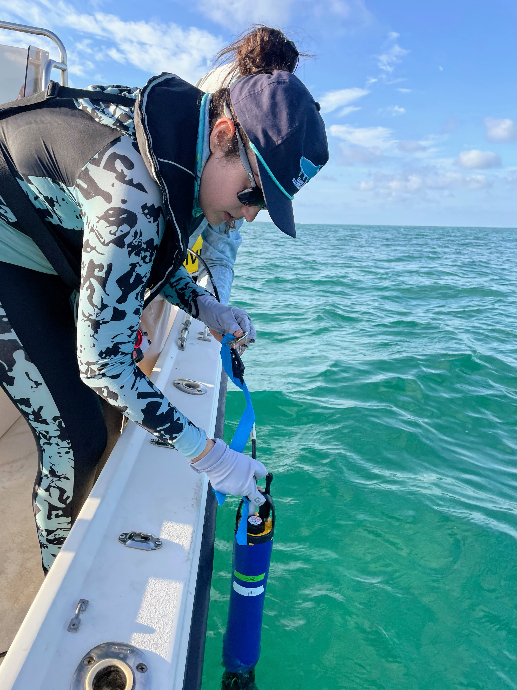
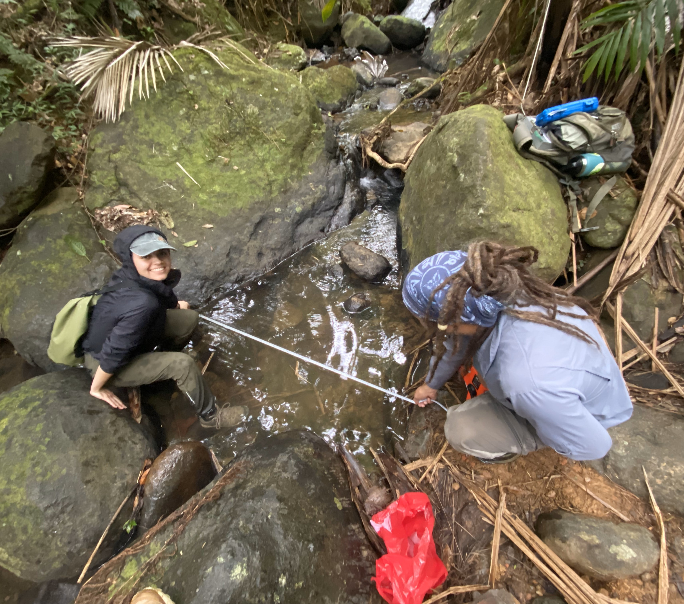
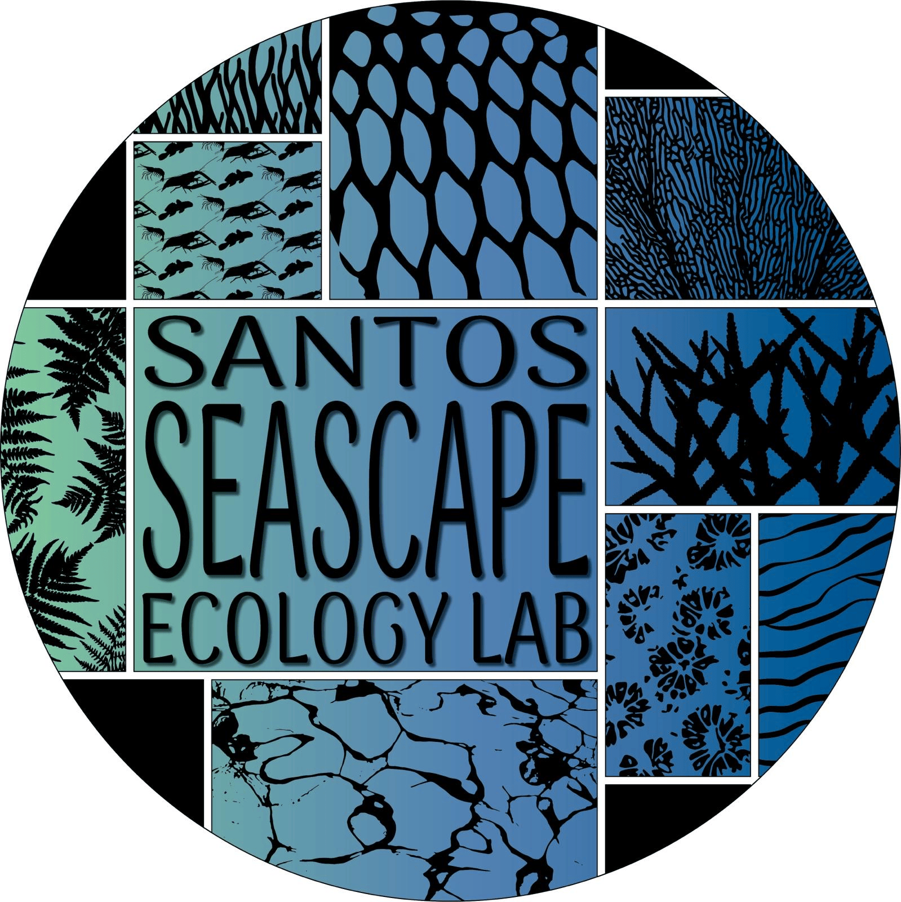

::: {.header-opps .opps-text}
# *Opportunities in our Lab:*
:::

::: {.centered-content}
## Prospective Graduate Students
Dr. Santos advises students through the [Department of Biological Sciences](https://case.fiu.edu/biology/) graduate program. Our sister lab, lead by Dr. Rehage, is in the Earth and Environment department. Thus, it is very wise when reaching out to our joint labs to understand the differences in the graduate school cirrculum between these two departments when choosing your major faculty advisor in our lab. The Biological Sciences department offers an MS and a PhD program in Biology. The deadline to apply for Fall is *December 1*. Both Dr. Santos and Dr. Rehage are quite selective about the people joining our lab, but are interested in taking students who are passionate about ecology, have a nagging curiosity about nature, are hardworking and are serious about scientific inquiry and graduate school. Graduate school is not necessarily for everyone…. In order to succeed in graduate school you really need to want it!

```{=html}
<div class="image-container-opps">
    
     
</div>
```

{.img-left-opps}

## Prospective Undergraduate interns and technicians

If you would like to join our lab as an intern or technician, check out our current research, read some of our publications, and do not hesitate to contact the respective lab graduate student for the project you are most interested in working with! We are always seeking enthusiastic undergraduates to assist us in our data collection and processing. If you are looking to get experience in marine biology, we would love to have you. Please attach your resume or CV when you reach out to a lab member. There are opportunities for undergraduate interns to gain fieldwork experience in our lab after enough time working with us.
:::

::: {.centered-content}
{.img-right-opps}

## About our University
FIU is a R1 public research university (Doctoral universities – highest research activity) and member of the State University System of Florida located in Miami, with a highly diverse, vibrant, and growing student body. Our multiple campuses serve over 58,000 students, making FIU the seventh largest U.S. university, and largest majority-minority serving institution in the US.  In addition, FIU also has the most diverse group of faculty of all universities in the US. The Department of Biology is within the [FIU Institute of Environment](https://environment.fiu.edu/about/index.html), which is an FIU preeminent program whose mission is to, in collaboration with local and international partners, provide data-driven solutions to society’s greatest and most urgent challenges.

:::
