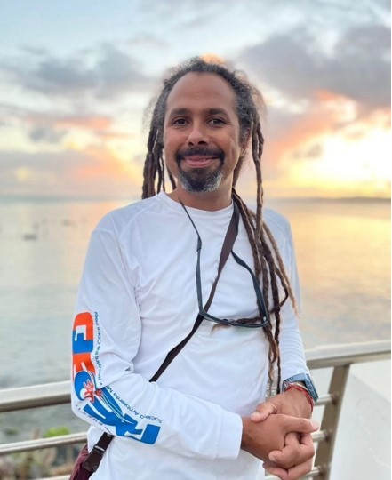
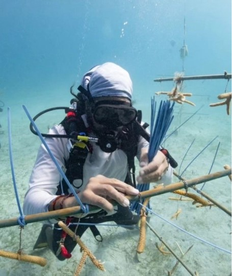
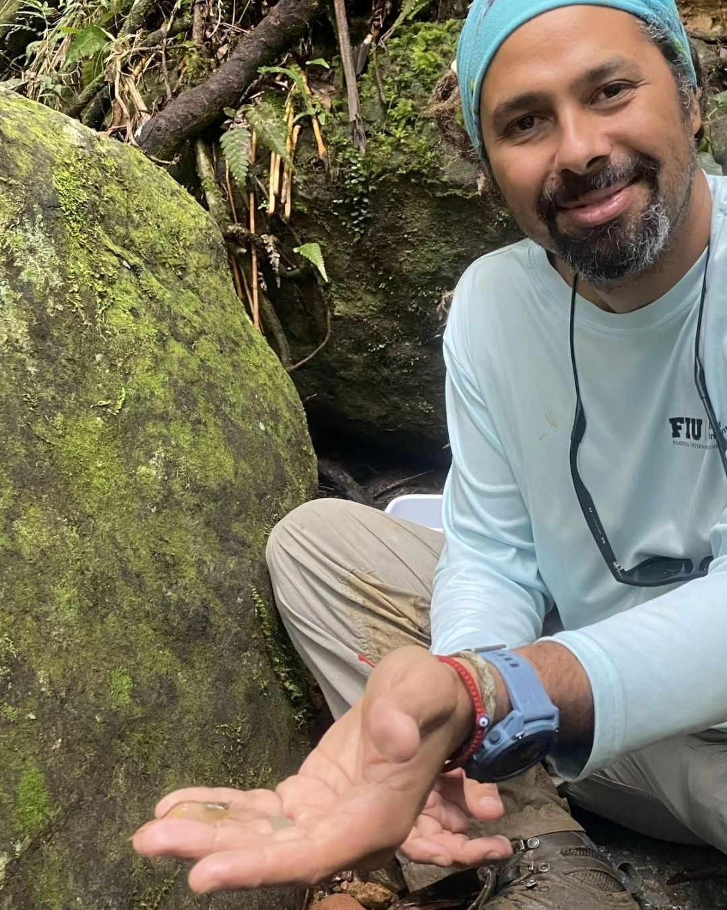

::: {.centered-content-rolo}
## Dr. Rolando Santos

Email: [rsantos\@fiu.edu](mailto:rsantos@fiu.edu)

{.img-right}

Rolando O. Santos is an Assistant Professor at Florida International University's (FIU) Biological Sciences Department and a researcher at FIU’s Institute of Environment. He has diverse academic and professional preparation in environmental science and geography (University of Puerto Rico), marine ecology, coastal management, and fisheries ecology (Nova Southeastern University, University of Miami). He has over 20 years of experience working on tropical aquatic and coastal systems in South Florida and Puerto Rico.

Anthropogenic activities, through direct (e.g., extraction or mechanical modifications) and indirect impacts (e.g., changes in disturbance regimes), in combination with other disturbances, have significantly caused shifts in the spatial configuration and dominance of coastal and aquatic habitats. These habitat-level changes have influenced these habitats' connectivity, heterogeneity, patchiness, and associated resources across multiple spatiotemporal scales. Thus, an integrative, spatially explicit research framework is needed to address complex questions that can help characterize and quantify the multi-scale dynamism of ecological processes. For this reason, Dr. Santos’ research is inspired to use, independently and interactively, conceptual and analytical frameworks developed in seascape/landscape, movement, and trophic ecology to address spatially explicit questions related to habitat-animal relationships.

{.img-left} At Florida International University, Dr. Santos leads the Seascape Ecology Lab at FIU, which focuses on applying this integrative approach between landscape, movement, and trophic ecology to design studies to increase our knowledge of how fish and invertebrate populations and communities respond to disturbances and habitat changes. His lab team and collaborators apply this integrative approach to studies in tropical forests, mangroves, seagrass, and coral reef ecosystems. By incorporating spatial and population dynamic analyses, niche modeling, and animal tracking, the lab pursues to understand the causes and ecological consequences of habitat changes across the ridge-to-reef continuum, primarily focusing on informing conservation, management, and restoration strategies.

Outside of the lab, Dr. Santos leads an active life, as he loves to go surf, skateboard with his dog, Maple, and try new restaurants.
:::

<!-- ::: {.centered-content-rolo} -->
<!-- {#rolo3} -->
<!-- ::: -->
